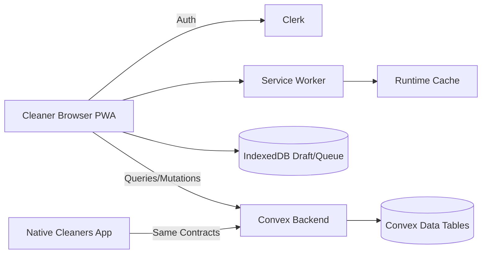
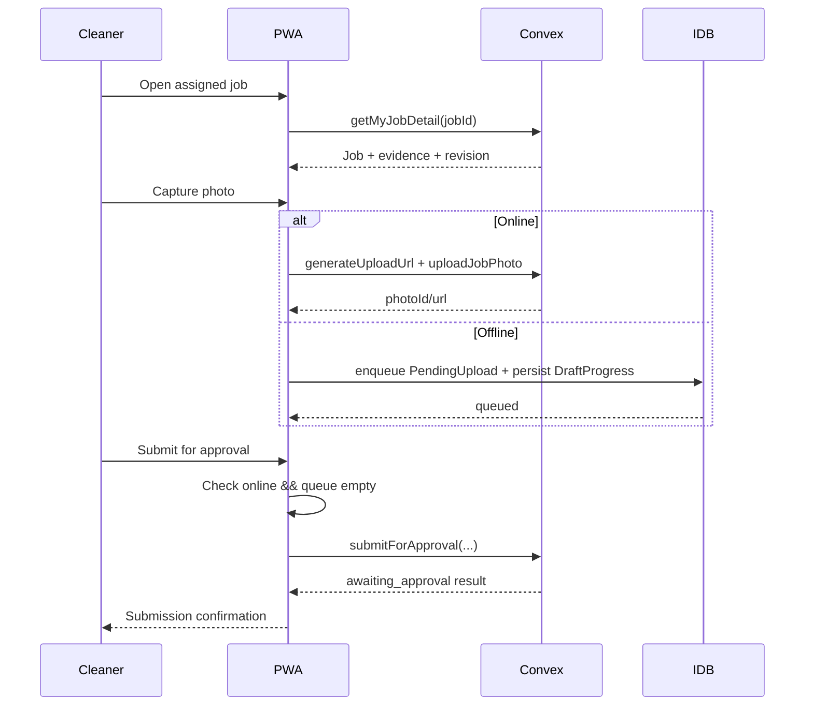
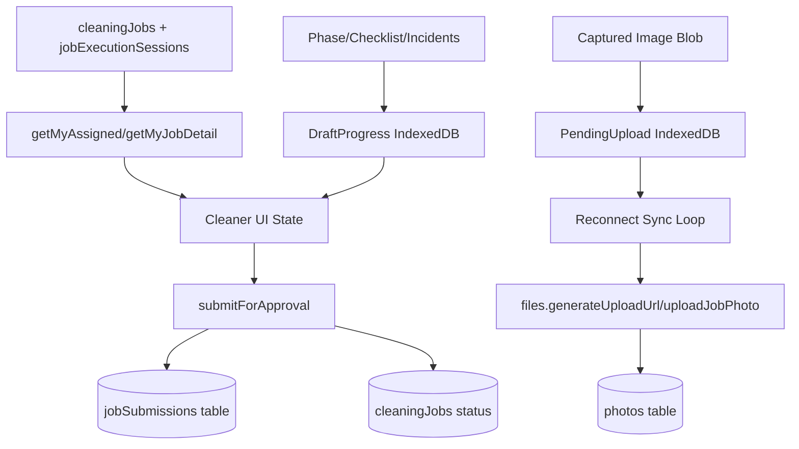

# OpsCentral Cleaner PWA (Scoped)

## Context

OpsCentral currently serves admin/property-ops/manager workflows in Next.js, while cleaners primarily use the separate native `jna-cleaners-app`. The shared Convex backend has already introduced revision-aware execution contracts (`start`, `pingActiveSession`, `submitForApproval`) that support cleaner job execution and approval workflows across clients.

The immediate need is a cleaner-scoped PWA surface inside `opscentral-admin` that can run in parallel with native, avoid duplicating business logic, and support field constraints (mobile-first UI, flaky connectivity, queueable photo uploads, resumable progress).

## Decision

Implement a cleaner-only PWA under `/cleaner` in this repository with the following constraints:

- Keep Convex as the sole source of business logic and workflow enforcement.
- Add cleaner-scoped Convex query APIs that derive identity server-side.
- Add a dedicated cleaner shell and execution experience instead of reusing admin-heavy job detail screens.
- Provide partial offline support (draft persistence + queued uploads), while requiring online + empty queue for final submission.
- Add PWA install/runtime assets scoped to cleaner usage and run the PWA in parallel with native app.

## Alternatives Considered

1. Separate cleaner web app deployment
- Pros: stronger UI/isolation boundary.
- Cons: higher maintenance, duplicated auth/integration wiring, slower delivery.
- Rejected for v1 speed and shared-contract leverage.

2. Reuse `/jobs` admin UI for cleaner role
- Pros: minimal frontend implementation.
- Cons: poor mobile UX, exposes admin-oriented controls, high risk of role-action confusion.
- Rejected due to operational UX and safety concerns.

3. Full offline-first submit queue in v1
- Pros: maximal resilience.
- Cons: higher complexity (conflict/replay semantics for submit), longer validation window.
- Rejected for phased delivery; deferred behind partial offline baseline.

## Implementation Plan

1. Routing and role access
- Update cleaner role access from `/jobs` to `/cleaner` in `src/lib/auth.ts`.
- Set cleaner default landing route to `/cleaner`.
- Keep `/jobs` inaccessible to cleaner so middleware redirects cleaners to `/cleaner`.

2. Convex cleaner-scoped contracts
- Add `cleaningJobs.queries.getMyAssigned({ status?, from?, to?, limit? })`.
- Add `cleaningJobs.queries.getMyJobDetail({ jobId })`.
- Both derive user with `getCurrentUser()` and enforce cleaner assignment or privileged role.
- Add `notifications.queries.getMyNotifications({ includeRead?, limit? })` with no `userId` arg.
- Extend `incidents.mutations.createIncident` with optional `photoIds` while preserving `photoStorageIds` compatibility.

3. Cleaner PWA UI surface
- Create `/cleaner` routes and mobile-first layout:
  - `/cleaner`
  - `/cleaner/jobs/[id]`
  - `/cleaner/jobs/[id]/active`
  - `/cleaner/history`
  - `/cleaner/incidents/new`
  - `/cleaner/settings`
- Implement role-specific execution phases:
  - before photos
  - cleaning checklist
  - after photos
  - incidents
  - review/submit
- Use Convex mutations only for workflow transitions and evidence submission.

4. Partial offline behavior
- Define offline contracts in cleaner UI module:
  - `PendingUpload`
  - `DraftProgress`
  - `SyncState`
- Store draft progress and upload queue in IndexedDB.
- Queue before/after/incident photo uploads while offline.
- Auto-drain queue on reconnect.
- Block final submit unless online and queue is empty.

5. PWA infrastructure
- Add cleaner-focused manifest and install metadata.
- Add service worker for static runtime caching and recent cleaner route payloads.
- Add install prompt + update UX controls in cleaner shell.

6. Verification
- Update auth unit tests for cleaner route behavior.
- Add offline queue utility tests.
- Validate contract behavior for cleaner access control and incident photo compatibility.
- Validate no regressions for existing admin routes.

## Risks and Mitigations

- Shared backend blast radius across web and native
  - Mitigation: additive-only schema/API changes and compatibility fields; no breaking behavior.

- Offline queue mismatch between local draft and server state
  - Mitigation: queue idempotency keys, explicit sync status, submit gating on empty queue.

- Cleaner accidentally reaching admin flows
  - Mitigation: stricter cleaner route allowlist and dedicated cleaner shell.

- PWA caching stale operational data
  - Mitigation: stale-while-revalidate strategy, focus cache on shell/runtime, keep critical workflow mutations network-authoritative.

## High-Level Diagram (ASCII)

```text
           +---------------------------+
           |   OpsCentral Next.js App  |
           |   /cleaner PWA Surface    |
           +-------------+-------------+
                         |
               Clerk Auth|Role Guard
                         v
                 +-------+--------+
                 |   Convex API   |
                 | jobs/files/etc |
                 +-------+--------+
                         |
                         v
                 +-------+--------+
                 | Shared Data     |
                 | (jobs/photos/   |
                 | sessions/etc.)  |
                 +-----------------+

Cleaner Device:
- Online: direct mutate/query
- Offline: IndexedDB draft + upload queue
- Reconnect: drain queue, then allow submit
```

## Architecture Diagram (Mermaid)



## Flow Diagram (Mermaid)



## Data Flow Diagram (Mermaid)



## Business Diagram (Excalidraw)

Create a companion Excalidraw artifact for business sharing.

- Companion file: `docs/2026-03-29-opscentral-cleaner-pwa-scoped-rollout-plan.excalidraw.md`
- Keep it top-level and audience-friendly.

---
Saved from Codex planning session on 2026-03-29 09:01.
