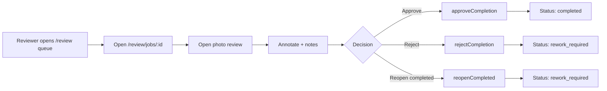
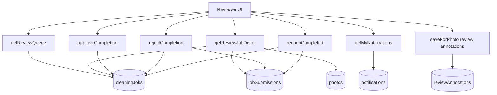

# Scoped Reviewer App for Approval Workflow Plan

Date: 2026-03-29

## Summary
- Build a dedicated reviewer surface under `/review` for `property_ops` and `manager`.
- Deliver v1 with review queue, per-job review detail, photo review + annotations, and approve/reject/reopen actions.
- Keep backend business logic in Convex and run this scoped app in parallel with existing `/jobs` flows.

## High-Level Diagram (ASCII)

```text
+----------------------+        +-----------------------+
|  Cleaner Scoped App  |        |  Reviewer Scoped App  |
|      (/cleaner)      |        |       (/review)       |
+----------+-----------+        +-----------+-----------+
           |                                |
           +---------------+----------------+
                           |
                    +------v------+
                    |   Convex    |
                    |   Backend   |
                    +-------------+
```

## Architecture Diagram (Mermaid)

```mermaid
graph TD
  A[Next.js App Router] --> B[/cleaner scoped UI]
  A --> C[/review scoped UI]
  B --> D[Convex queries/mutations]
  C --> D
  D --> E[(cleaningJobs)]
  D --> F[(photos)]
  D --> G[(jobSubmissions)]
  D --> H[(reviewAnnotations)]
  D --> I[(notifications)]
```

## Flow Diagram (Mermaid)



## Data Flow Diagram (Mermaid)



## Public API / Interface Changes
- Update web role routing/auth checks so `property_ops` and `manager` can access `/review` and nested routes.
- Keep existing `/jobs` available in v1; add explicit navigation entry to `/review`.
- Add Convex reviewer queries:
  - `cleaningJobs.queries.getReviewQueue({ status?, propertyId?, from?, to?, limit? })`
  - `cleaningJobs.queries.getReviewJobDetail({ jobId })`
- Reuse existing decision mutations:
  - `cleaningJobs.approve.approveCompletion`
  - `cleaningJobs.approve.rejectCompletion`
  - `cleaningJobs.approve.reopenCompleted`
  - `reviewAnnotations.mutations.saveForPhoto`
- Reuse `notifications.queries.getMyNotifications` for reviewer notifications.

## Implementation Changes
- Add dedicated routes:
  - `/review`
  - `/review/jobs/[id]`
  - `/review/jobs/[id]/photos-review`
- Add reviewer-specific shell/components (`src/components/review/*`) with desktop-first dense queue + filters and explicit decision actions.
- Keep photo review annotation workflows integrated and accessible from scoped reviewer routes.
- Keep all transition rules in Convex, with no schema-breaking changes.

## Test Plan
- Unit tests:
  - Update `src/lib/auth.test.ts` to validate `/review` route access for `property_ops`/`manager` and deny cleaner.
- Convex contract/security tests:
  - `getReviewQueue/getReviewJobDetail` authorize reviewer roles and reject cleaner.
  - Decision mutations preserve allowed transitions.
- E2E acceptance:
  - Reviewer can review queue, open detail, annotate photos, approve, reject, and reopen.
  - Existing `/jobs` and `/cleaner` flows remain unaffected.

## Assumptions and Defaults
- Reviewer scope in v1 targets `property_ops` and `manager`.
- Rollout is parallel (no deprecation of existing admin pages yet).
- Reviewer flow is online-only in v1.
- Convex schema remains backward-compatible.
