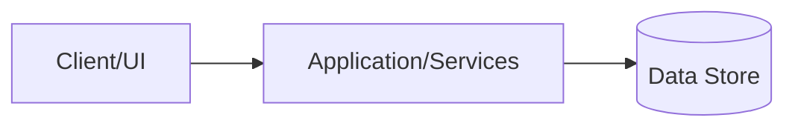
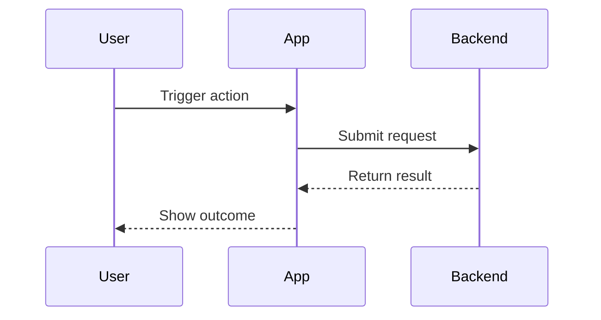
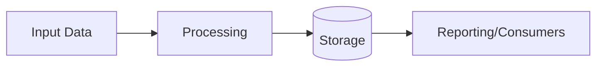

# Critical Property Checks and Refill Management

## Context
Add mandatory room-based critical checkpoint verification and refill percentage checks to cleaning execution, with automated low-stock ops signaling.

## Decision
Implement mobile-first, backed by shared Convex data/contracts, then mirror to web with setup/review/queue surfaces.

## Alternatives Considered
- Web-first rollout.
- Warning-only gating.
- Separate refill model outside inventory.

## Implementation Plan
- Add Convex tables/contracts for checkpoints, job check results, refill checks, and refill queue.
- Extend submit gate to require both checkpoint + refill completion.
- Add mobile cleaner steps for critical checks and refill checks in both Quick and Standard flows.
- Add web setup/review/queue parity in phase 2.

## Risks and Mitigations
- Risk: submit friction for cleaners.
- Mitigation: simple percent bands, room grouping, skip with reason, clear review summaries.

## High-Level Diagram (ASCII)

```text
[Simple high-level structure]
Client -> Services -> Data Store
```

## Architecture Diagram (Mermaid)



## Flow Diagram (Mermaid)



## Data Flow Diagram (Mermaid)



## Business Diagram (Excalidraw)

Create a companion Excalidraw artifact for business sharing.

- Companion file: `docs/2026-04-02-critical-property-checks-and-refill-management-plan.excalidraw.md`
- Keep it top-level and audience-friendly.

---
Saved from Codex planning session on 2026-04-02 22:02.
