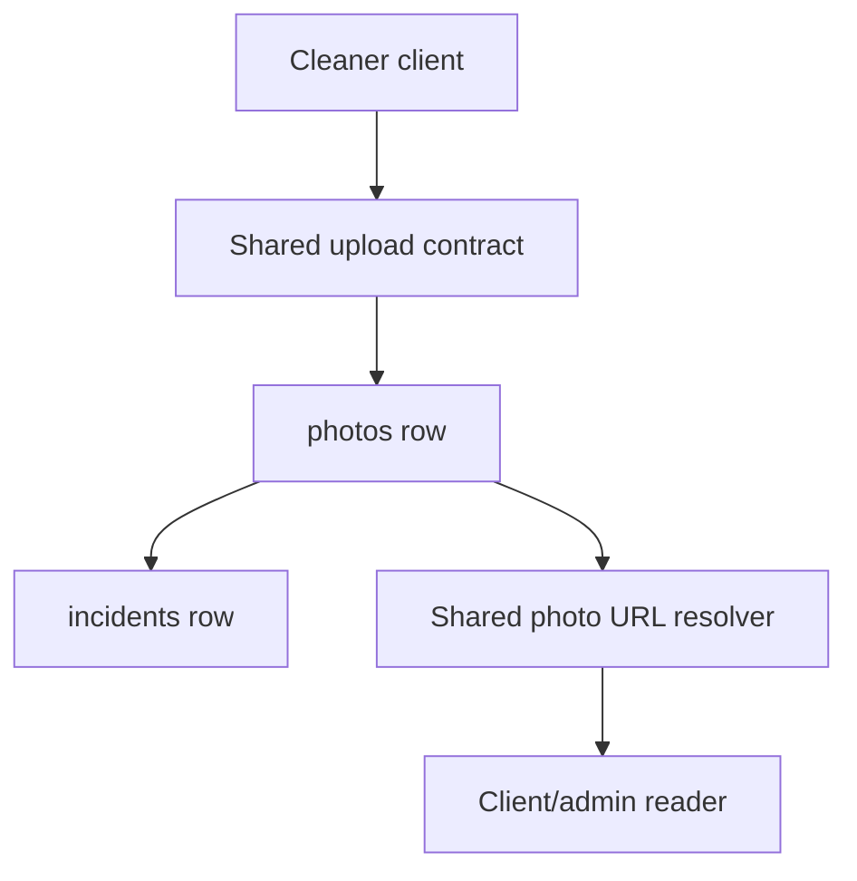
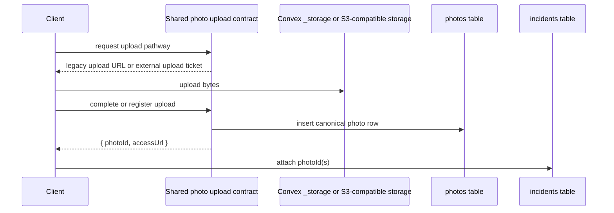

# ADR: Canonical Photo Model and Upload Contract

## Status

Accepted

## Date

2026-04-04

## Context

Cleaner-originated photos currently exist in two different logical shapes:

- canonical `photos` records tied to cleaning jobs
- raw `_storage` object references attached directly to incidents

That split leaks storage concerns into business records. It also prevents a clean transition from legacy Convex `_storage` to S3-compatible object storage because incident consumers must understand both record-level and storage-level identifiers.

The backend already contains the ingredients for a normalized model:

- legacy upload to Convex `_storage`
- external upload ticket generation
- external upload completion that persists object metadata on `photos`
- URL resolution through `resolvePhotoAccessUrl`

What is missing is the architectural decision that every cleaner-originated photo must resolve to a `photos` record, regardless of the underlying blob location.

## Decision

We adopt the following canonical model:

- every cleaner-originated photo is represented by one `photos` row
- `incidents.photoIds` will be `Id<"photos">[]` in the final normalized state
- raw `_storage` IDs are transitional only and must not remain part of the permanent incident contract
- the `photos` record owns storage metadata:
  - `storageId` for legacy Convex storage
  - `provider`, `bucket`, `objectKey`, and `objectVersion` for external storage
- callers do not infer URLs from storage metadata directly; they use shared read-side resolution

We also adopt one logical backend upload contract:

- create an upload ticket or legacy registration through a shared photo-oriented API
- finalize every successful upload by inserting a `photos` record
- attach incidents to photo records, not to storage-layer identifiers

The canonical model applies to:

- before photos
- after photos
- in-job incident photos
- standalone incident photos

It does not apply in this phase to:

- admin property photos
- company logos
- user avatars

## Consequences

Positive consequences:

- one incident-photo contract across PWA and mobile
- one read-side URL resolution path regardless of storage tier
- cleaner clients can change upload strategy without changing incident semantics
- archival, storage migration, and cost-tier policies remain isolated to `photos`

Costs and tradeoffs:

- `photos` can no longer be modeled as job-only records; incident-only photos need normalized ownership fields
- schema migration is required because incidents currently store mixed string IDs
- legacy compatibility code must remain until both clients and historical data are migrated

## Alternatives Considered

### Alternative 1: Keep `incidents.photoIds` as `string[]`

Rejected.

It encodes transitional compatibility as a permanent domain model and forces every reader to interpret strings dynamically.

### Alternative 2: Store incident photos outside `photos`

Rejected.

That creates parallel media systems for evidence and incidents and breaks consistent review, access, and archival behavior.

### Alternative 3: Make storage tier part of the incident contract

Rejected.

Storage location is not incident business data. It belongs to the media record.

## Mermaid Diagrams

### Entity and Data Flow

### Upload Completion Flow

### Migration State Transition

## Implementation Notes

Required model changes:

- widen `photos` so incident-only photos can be first-class rows
- add or normalize ownership fields needed for incident-only photos
- widen `incidents.photoIds` only as a transitional measure during migration
- provide one shared helper that resolves photo references to URLs for all consumers

Required contract behavior:

- legacy Convex `_storage` uploads must still end in a `photos` row
- S3-compatible uploads must still end in a `photos` row
- no client may consider an upload complete until a `photos` row exists

Migration rule:

- if a historical incident references a legacy `_storage` ID, create a corresponding `photos` row and replace that ref before narrowing the schema
