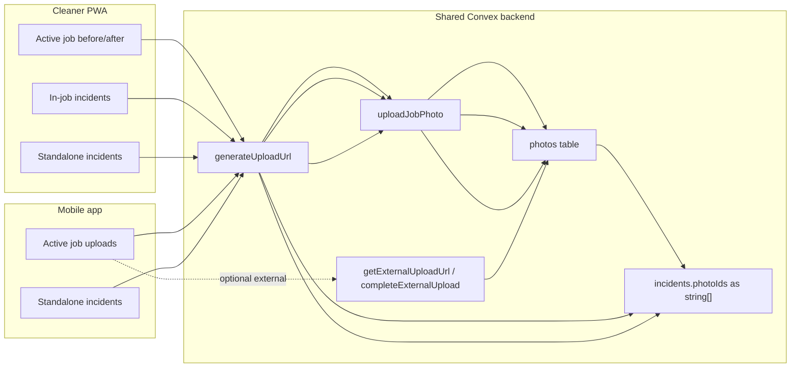
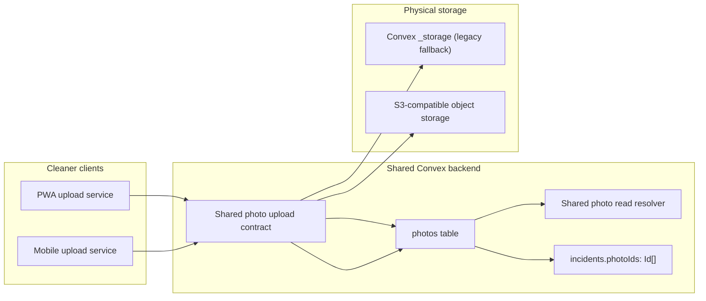
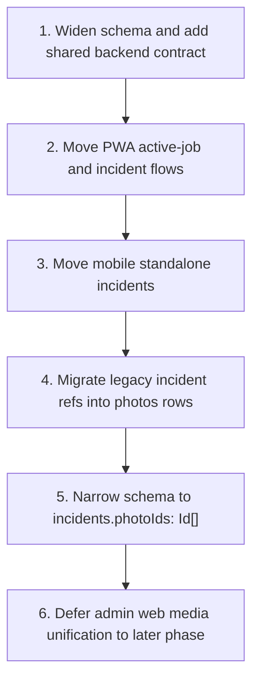

# ADR: Normalize Cleaner Photo Uploads onto a Shared Photo Record and S3-Compatible Storage Path

## Status

Accepted

## Date

2026-04-04

## Context

The current photo-upload architecture is functionally split across multiple cleaner-facing paths:

- the cleaner PWA active-job flow uses a `photos` record and can queue uploads offline
- the cleaner PWA standalone incident flow can still upload raw bytes and attach `_storage` IDs directly to incidents
- the mobile app has a stronger upload-service abstraction and already anticipates external S3-compatible storage
- the shared Convex backend already contains both legacy `_storage` support and an external upload path, but the cleaner clients do not use a single canonical contract end to end

This creates four operational gaps:

1. incident attachments are not normalized onto a single record model
2. raw `_storage` IDs and `photos` IDs are mixed in the same incident field
3. the PWA does not share the same upload strategy abstraction as mobile
4. external object storage exists in the backend but is not the cleaner-wide canonical path yet

These gaps matter because the same Convex deployment serves both the PWA and the mobile app. The architecture must be decision-complete before implementation so that schema, compatibility, and rollout do not diverge across clients.

This ADR set covers only cleaner-originated evidence and incident photos. Admin web media uploads such as property photos, logos, and avatars are explicitly out of scope for this phase.

## Decision

We will normalize cleaner-originated photo uploads around a single architecture:

- `photos` is the canonical record for all cleaner-originated media
- incident records will reference `photos` IDs only in the final state
- raw `_storage` IDs are transitional compatibility artifacts only
- storage location is an implementation detail of the `photos` record, not of `incidents`
- the shared backend will support both legacy Convex `_storage` uploads and external S3-compatible uploads through one logical upload contract
- the rollout order is:
  - shared backend first
  - cleaner PWA second
  - mobile app third
  - admin web media later

This umbrella ADR is authoritative for the target architecture. The narrower ADRs below define the canonical data model and the rollout/compatibility rules.

## Consequences

Positive consequences:

- all cleaner evidence and incident media become readable through a single record model
- read paths can resolve URLs uniformly without caller knowledge of physical storage location
- migration can happen without cutting off legacy clients immediately
- PWA and mobile can converge on the same strategy model: `legacy | external | auto`

Costs and constraints:

- the schema must be widened before migration because `incidents.photoIds` currently mixes identifier shapes
- implementation must keep backward compatibility while both cleaner clients are in flight
- old incident attachments that only have `_storage` IDs will need migration into `photos` rows before final narrowing

## Alternatives Considered

### Alternative 1: Keep incident attachments as raw storage references

Rejected.

This preserves the current inconsistency and keeps incident read paths coupled to storage internals.

### Alternative 2: Migrate only the PWA and leave mobile on its current special cases

Rejected.

This would turn a shared backend into two long-term client contracts and make future storage changes more expensive.

### Alternative 3: Standardize all media, including admin web uploads, in the same phase

Deferred.

That is a larger media-architecture initiative. The current priority is cleaner evidence and incidents.

## Mermaid Diagrams

### Current-State Architecture

### Target-State Architecture

### Rollout Sequence

## Related ADRs

- [Canonical Photo Model and Upload Contract](./2026-04-04-canonical-photo-model-adr.md)
- [Photo Upload Rollout and Compatibility Strategy](./2026-04-04-photo-upload-rollout-and-compatibility-adr.md)

## Related Reference Documents

- [Photo Upload Architecture Index](./2026-04-04-photo-upload-architecture-index.md)
- [Cleaner PWA Photo Upload Architecture](./2026-04-04-photo-upload-architecture-cleaner-pwa.md)
- [Mobile App Photo Upload Architecture](./2026-04-04-photo-upload-architecture-mobile-app.md)
- [Admin Web Photo Upload Architecture](./2026-04-04-photo-upload-architecture-admin-web.md)

## Implementation Notes

- External storage in this phase remains the existing S3-compatible path backed by B2 or MinIO configuration.
- The implementation must follow widen-migrate-narrow sequencing because this Convex deployment is shared across both cleaner clients.
- Any new backend contract should be implemented in the owner backend repo only and mirrored to the mobile app afterward.
