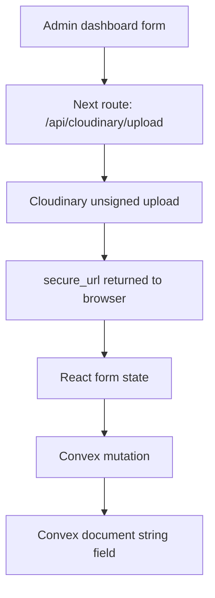
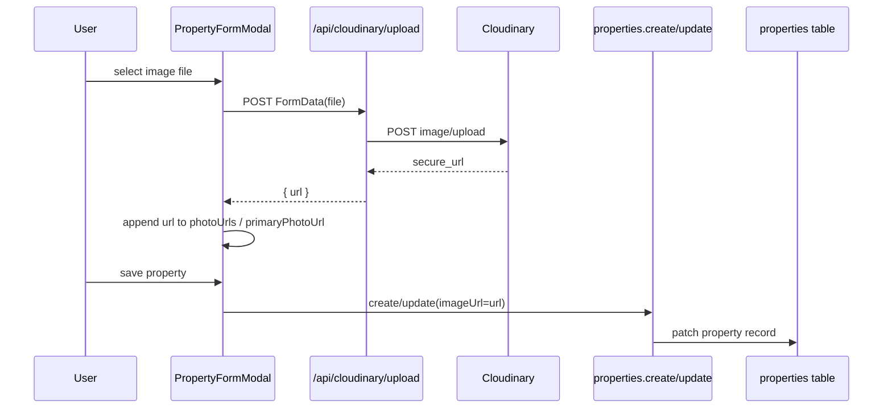
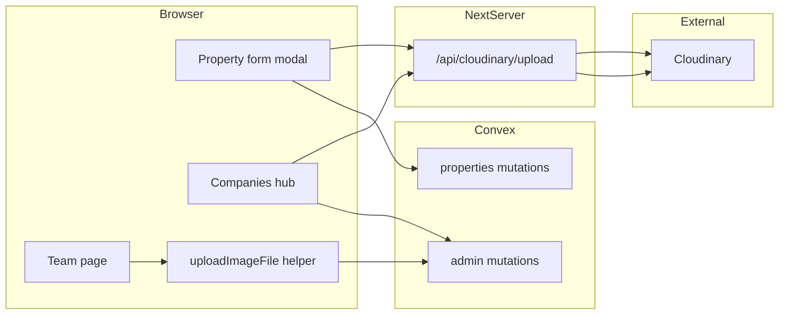
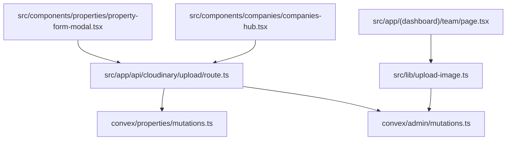

# Admin Web Photo Upload Architecture

## Scope

This document covers the non-cleaner upload surfaces inside the Next.js admin dashboard:

- property photos
- company logos
- team member avatars

These flows do **not** use the `photos` table that cleaner job evidence uses. They are URL-based uploads.

## Upload Surfaces

| Surface | Entry point | Upload transport | Persisted as |
| --- | --- | --- | --- |
| Property primary photo / gallery URL list | `src/components/properties/property-form-modal.tsx` | `POST /api/cloudinary/upload` | `properties.imageUrl` via `convex/properties/mutations.ts` |
| Company logo | `src/components/companies/companies-hub.tsx` | `POST /api/cloudinary/upload` | `cleaningCompanies.logoUrl` via `convex/admin/mutations.ts:updateCleaningCompany` |
| Team member avatar | `src/app/(dashboard)/team/page.tsx` | client-side image resize to data URL | `users.avatarUrl` via `convex/admin/mutations.ts:updateUser` |

## Architecture



## Sequence: Property Photo Upload



## Sequence: Team Avatar Upload

```mermaid
sequenceDiagram
    participant User
    participant Page as Team page
    participant Helper as uploadImageFile()
    participant Canvas as Browser Canvas
    participant Convex as admin.updateUser
    participant DB as users table

    User->>Page: select image file
    Page->>Helper: uploadImageFile(file)
    Helper->>Canvas: resize + encode JPEG data URL
    Canvas-->>Helper: data URL
    Helper-->>Page: avatarUrl=data:image/jpeg;base64,...
    User->>Page: save profile
    Page->>Convex: updateUser({ avatarUrl })
    Convex->>DB: patch users.avatarUrl
```

## Touch Points



## Persistence Notes

- Property uploads are reduced to a URL before persistence. The property record stores `imageUrl`; the richer `propertyImages` table exists in schema but is not the active path used by the modal today.
- Company logos are also URL-only.
- Team avatars are not uploaded to Cloudinary in the current code path. They are resized in-browser and then stored directly as string data in `users.avatarUrl`.

## Operational Implications

- Admin media flows are simple but inconsistent:
  - property/company use Cloudinary
  - team avatars use inline data URLs
- These uploads bypass the cleaner evidence pipeline entirely:
  - no `photos` table
  - no review snapshots
  - no signed Convex read URLs
- If we want one unified media architecture later, team avatars are the clearest outlier.

## Source Files


