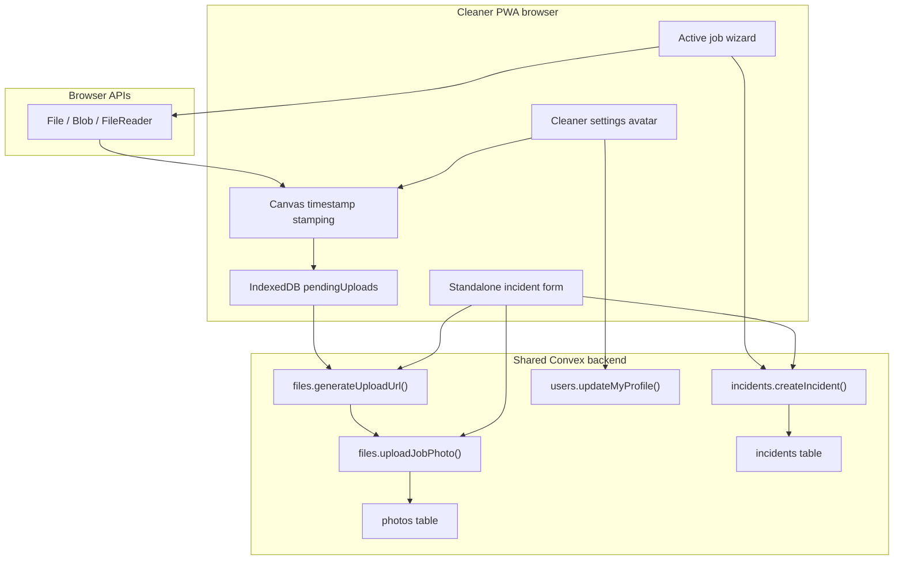
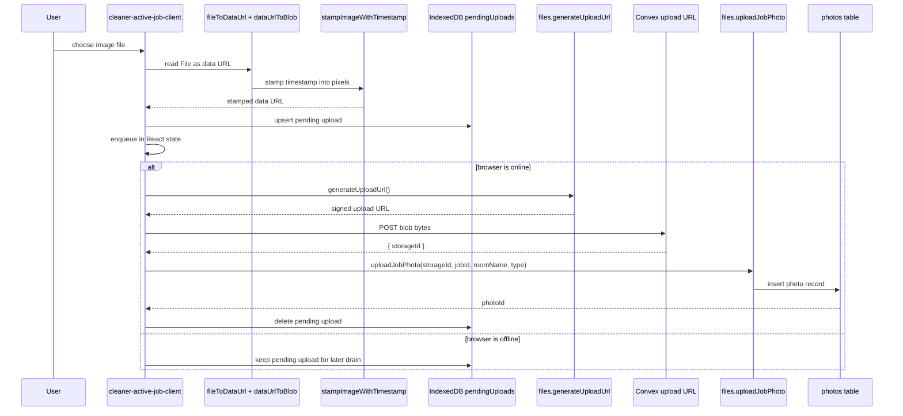
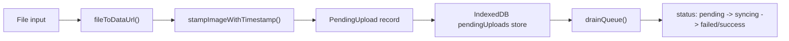
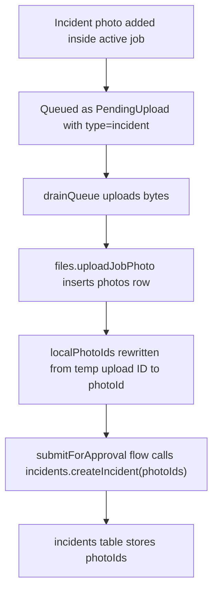
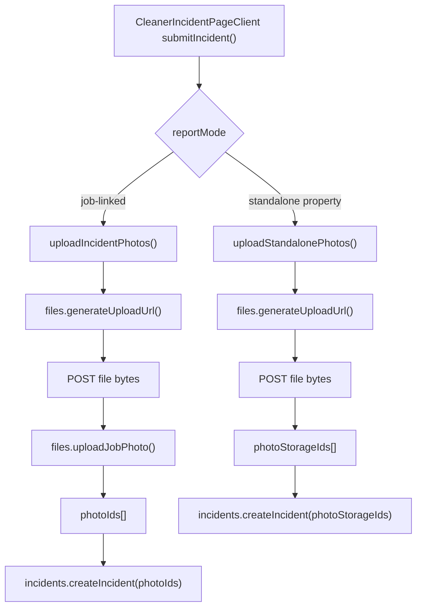
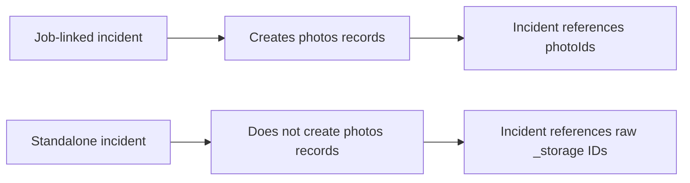
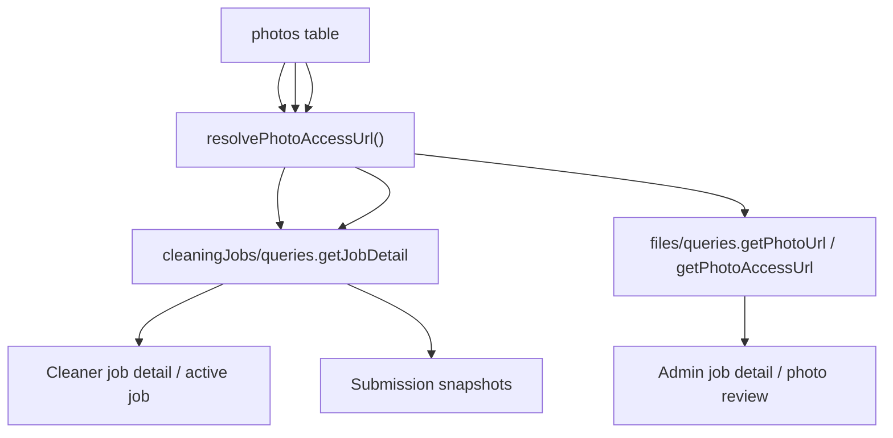
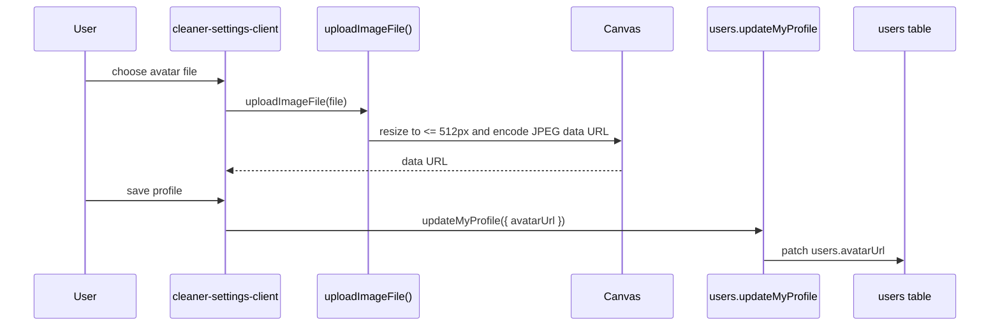
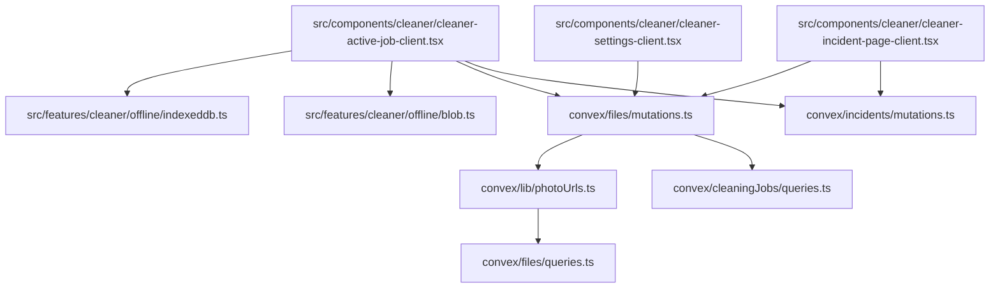

# Cleaner PWA Photo Upload Architecture

## Scope

This document covers every upload touch point inside the cleaner PWA:

- before photos
- after photos
- in-job incident photos
- standalone incident photos
- cleaner profile avatar

This is the most complex upload path in the repo because it mixes browser capture, offline queueing, Convex storage, and two different incident persistence strategies.

## Upload Surface Inventory

| Surface | Entry point | Queue/offline | Final persistence |
| --- | --- | --- | --- |
| Before photos in active job | `src/components/cleaner/cleaner-active-job-client.tsx` | Yes, IndexedDB queue | `photos` table via `files.uploadJobPhoto` |
| After photos in active job | `src/components/cleaner/cleaner-active-job-client.tsx` | Yes, IndexedDB queue | `photos` table via `files.uploadJobPhoto` |
| In-job incident photos | `src/components/cleaner/cleaner-active-job-client.tsx` | Yes, same queue | `photos` table first, then `incidents.photoIds` |
| Standalone incident screen, linked to a job | `src/components/cleaner/cleaner-incident-page-client.tsx` | No | `photos` table first, then `incidents.photoIds` |
| Standalone incident screen, property-only | `src/components/cleaner/cleaner-incident-page-client.tsx` | No | `_storage` IDs directly in `incidents.photoIds` |
| Cleaner avatar in settings | `src/components/cleaner/cleaner-settings-client.tsx` | No | `users.avatarUrl` string |

## Architecture Overview

## Detailed Flow: Active Job Before/After Photos

## Queue Model

## In-Job Incident Photos

## Standalone Incident Flows

## Critical Distinction: Job-Linked vs Standalone Incident

That distinction matters because:

- job-linked incident photos participate in the normal `photos` read path
- standalone incident photos skip the `photos` table entirely
- review and evidence tooling are therefore more consistent for job-linked incidents than for standalone incidents

## Read-Side Touch Points

## Cleaner Avatar Path

## Touch Points By File

## Key Findings

- The active-job wizard is the canonical PWA evidence pipeline.
- The PWA has a real offline queue, but only for the active-job flow.
- The standalone incident screen bypasses the queue entirely.
- Standalone incidents are still hybrid and can store raw `_storage` IDs instead of `photoId`s.
- Cleaner avatars are an unrelated URL-string flow and do not share the evidence pipeline.
