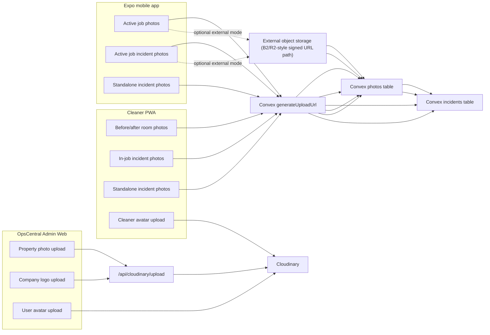
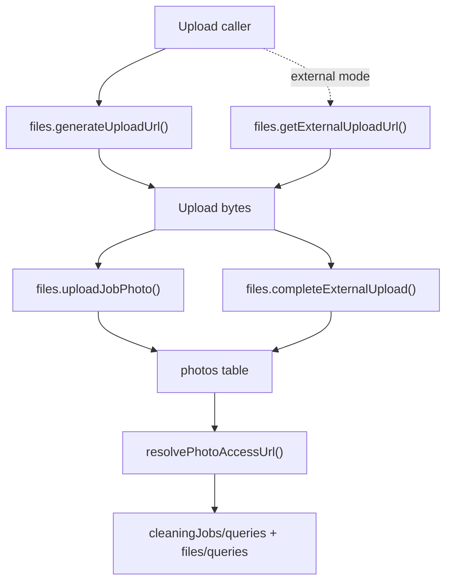

# Photo Upload Architecture Index

This set of documents maps every photo upload path we currently have across the OpsCentral ecosystem.

## Documents

- [Admin web uploads](./2026-04-04-photo-upload-architecture-admin-web.md)
- [Cleaner PWA uploads](./2026-04-04-photo-upload-architecture-cleaner-pwa.md)
- [Mobile app uploads](./2026-04-04-photo-upload-architecture-mobile-app.md)

## Short Answer On Mobile

Yes, the mobile app needs its own architecture map.

The mobile upload path is not just a copy of the PWA path:

- The PWA uses browser `File` objects, Canvas timestamp stamping, IndexedDB, and a local retry queue.
- The mobile app uses Expo camera/library capture, URI-based uploads, compression utilities, and a dedicated upload service abstraction with `legacy`, `external`, and `auto` modes.
- The standalone incident path in mobile still uses a special legacy `_storage` flow that is different from both the PWA job flow and the admin web Cloudinary flow.

## High-Level System Map

## Shared Back-End Contracts

## Important Current Distinctions

- Admin web media uploads are mostly URL-oriented. The browser uploads to Cloudinary and then stores the returned URL in regular string fields such as `imageUrl`, `logoUrl`, and `avatarUrl`.
- Cleaner job media uploads are record-oriented. The browser uploads raw bytes to Convex storage first, then creates a `photos` record tied to a cleaning job.
- Standalone incident uploads are still hybrid. They can bypass the `photos` table and attach raw `_storage` IDs directly to the incident payload.
- Mobile is already designed for an external-storage future. The upload service can use legacy Convex storage or a signed external upload path.
