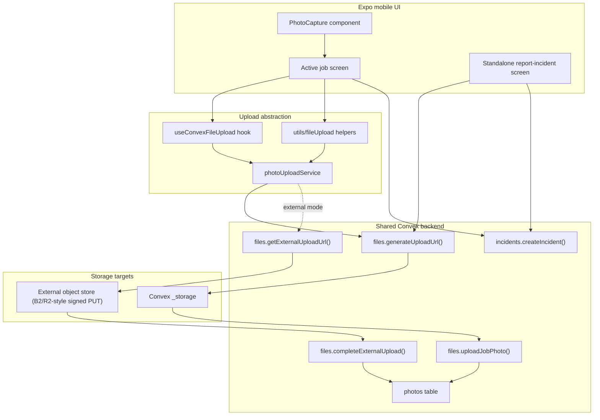
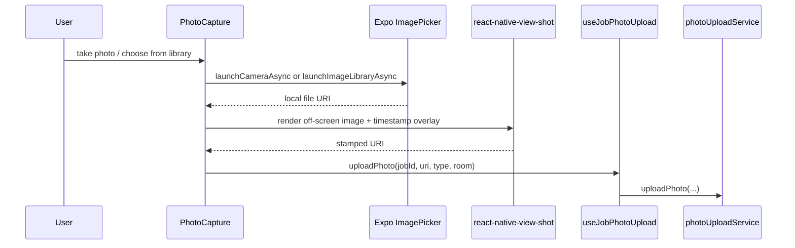
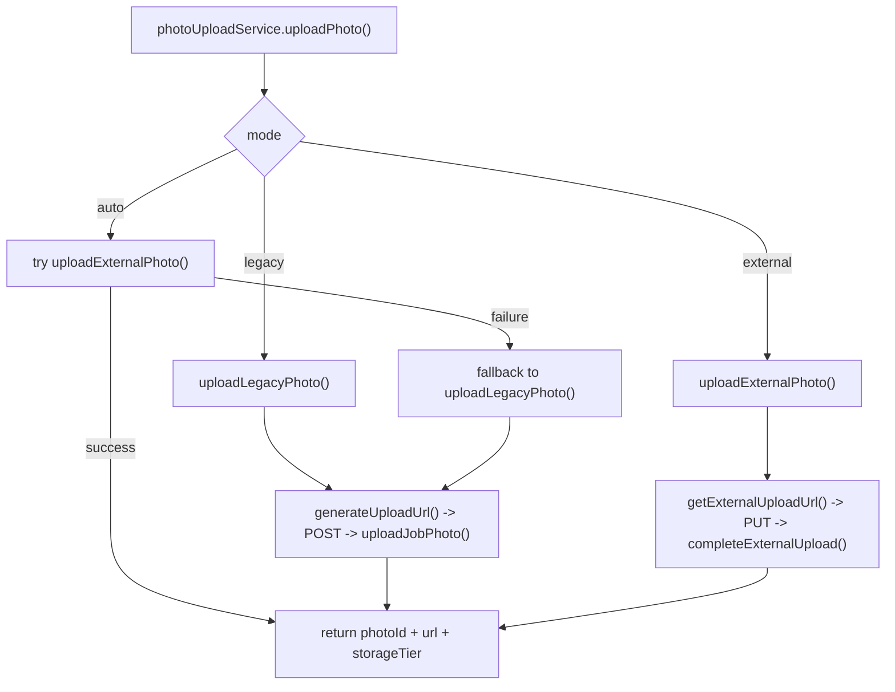
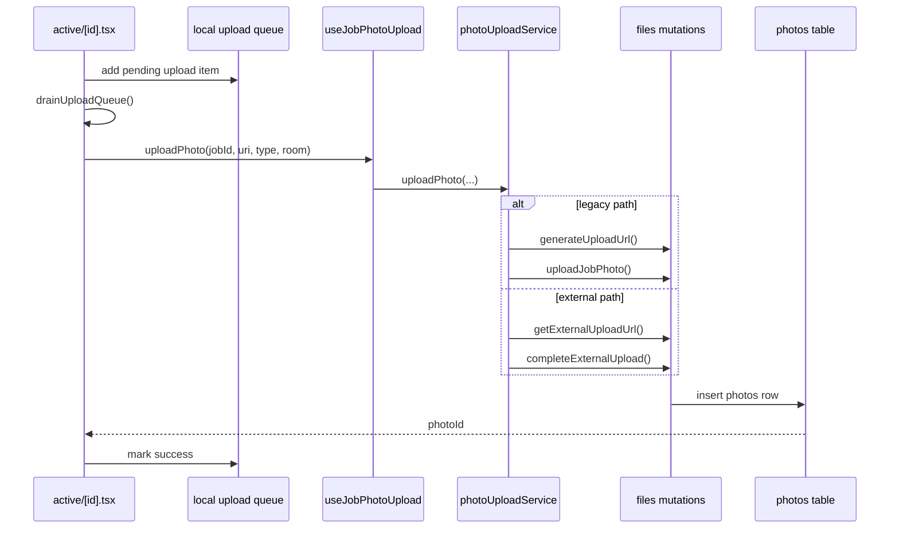
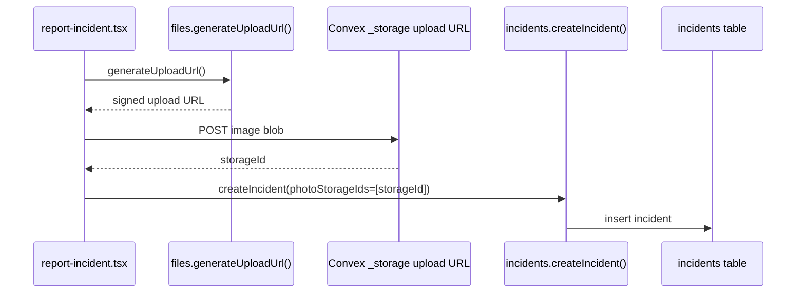
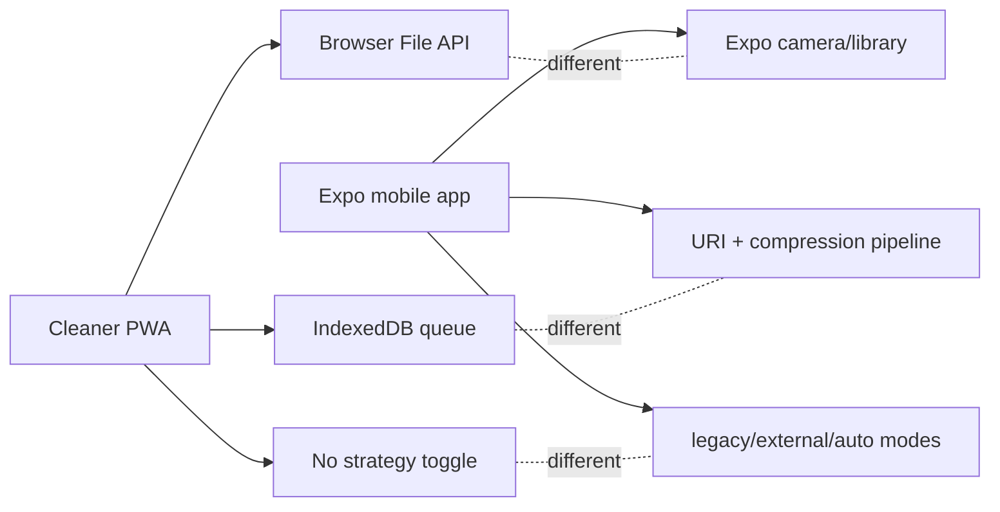
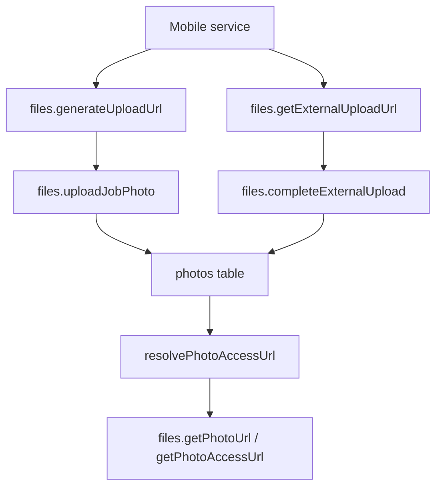

# Mobile App Photo Upload Architecture

## Scope

This document maps the sibling Expo cleaner mobile app at:

- `/Users/atem/sites/jnabusiness_solutions/apps-ja/jna-cleaners-app`

It is separate from the PWA and should be documented separately because it has its own capture stack, upload service abstraction, and rollout path toward external object storage.

## Upload Surface Inventory

| Surface | Entry point | Upload abstraction | Persistence |
| --- | --- | --- | --- |
| Active job before/after photos | `app/(cleaner)/active/[id].tsx` | `useJobPhotoUpload()` -> `photoUploadService` | `photos` table |
| Active job incident photos | `app/(cleaner)/active/[id].tsx` | `useJobPhotoUpload()` -> `photoUploadService` | `photos` table then incident photo IDs |
| Standalone incident report | `app/(cleaner)/report-incident.tsx` | direct `generateUploadUrl()` | raw `_storage` IDs in incident |
| Generic upload utilities | `hooks/useConvexFileUpload.ts`, `utils/fileUpload.ts` | same shared service | depends on chosen mode |

## Architecture Overview

## Capture Layer

The mobile app has a capture stack that the PWA does not have:

- `components/PhotoCapture.tsx`
  - uses `expo-image-picker`
  - supports camera and photo library
  - stamps a timestamp by rendering an off-screen view and capturing it with `react-native-view-shot`
- `utils/fileUpload.ts`
  - compresses images with `expo-image-manipulator`
  - exposes helpers for single, multiple, before/after pair, and incident uploads

## Upload Strategy Modes

The mobile app already has an explicit upload strategy abstraction:

- `legacy`
  - `files.generateUploadUrl()`
  - upload bytes to Convex `_storage`
  - `files.uploadJobPhoto()`
- `external`
  - `files.getExternalUploadUrl()`
  - upload bytes directly to signed external URL
  - `files.completeExternalUpload()`
- `auto`
  - try external first
  - fallback to legacy on failure

## Active Job Flow

## Standalone Incident Flow

This path is still legacy and separate.

## Why Mobile Needs A Separate Document

## Shared Back-End Contracts With Mobile

## Key Findings

- Mobile and PWA share the same Convex data model but not the same client architecture.
- Mobile is already built around an upload service boundary. That is a real architectural seam we do not have in the PWA.
- Mobile already anticipates external object storage, while the PWA still uses the simpler legacy Convex storage path.
- The standalone incident screen in mobile is still a special-case legacy path and should stay documented separately until it is normalized.
