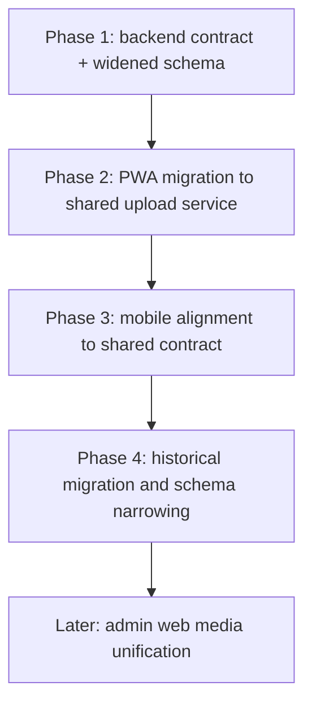
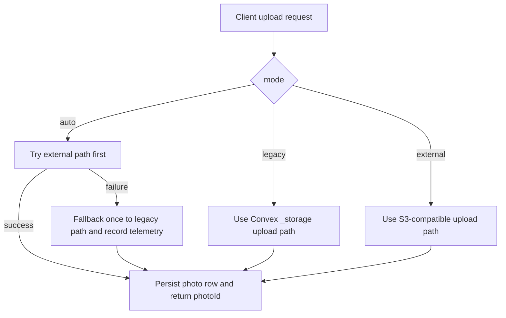

# ADR: Photo Upload Rollout and Compatibility Strategy

## Status

Accepted

## Date

2026-04-04

## Context

The target architecture is clear, but rollout order matters because:

- the Convex deployment is shared by the PWA and the mobile app
- the PWA currently has the largest gap between current implementation and target upload model
- mobile already has an upload-service abstraction and is therefore easier to align after the backend contract is stabilized
- admin web media uploads are a separate concern and would broaden the rollout without helping cleaner evidence first

The migration must protect three things at the same time:

1. legacy evidence uploads must keep working during the transition
2. old photos and incidents must remain readable
3. no client should be forced to switch storage mode before the backend and read paths are ready

## Decision

The rollout order is fixed as follows:

1. backend first
2. PWA second
3. mobile third
4. admin web media later

The compatibility strategy is also fixed:

- use widen-migrate-narrow for schema changes
- keep compatibility wrappers until both cleaner clients are migrated
- standardize cleaner client strategy modes as:
  - `legacy`
  - `external`
  - `auto`
- use `auto` only as a rollout bridge, not as a replacement for proper observability and migration control

Phase-specific decisions:

- Phase 1:
  - widen schema
  - add generalized backend upload and read contracts
  - keep current legacy endpoints functioning
- Phase 2:
  - migrate the PWA active-job and incident flows to the new client abstraction
  - keep fallback to legacy path available
- Phase 3:
  - migrate the mobile standalone incident flow to the same canonical model
  - point the existing mobile service abstraction at the generalized backend contract
- Phase 4:
  - migrate historical legacy incident refs into `photos`
  - narrow schema to `incidents.photoIds: Id<"photos">[]`

Admin web media is explicitly deferred. It is not blocked by this work and should not expand this rollout.

## Consequences

Positive consequences:

- rollout is incremental instead of all-or-nothing
- the riskiest client, the PWA, is stabilized before mobile consumes the finalized backend contract
- schema narrowing only happens after both runtime clients and historical data are ready

Costs and tradeoffs:

- backend compatibility code exists longer than the final architecture would otherwise require
- transitional readers must understand both normalized photo refs and legacy incident refs
- telemetry and validation are required to know when legacy fallback can be removed

## Alternatives Considered

### Alternative 1: Move both cleaner clients at once

Rejected.

That increases coordination risk on a shared backend and makes root-cause isolation harder if uploads regress.

### Alternative 2: Migrate mobile first

Rejected.

Mobile is already closer to the target architecture. The PWA is the real architecture gap and should validate the shared contract first.

### Alternative 3: Include admin web media in the same rollout

Deferred.

Admin web media currently uses Cloudinary and data URLs and is not required to normalize cleaner evidence and incident photos.

## Mermaid Diagrams

### Phased Rollout

### Client Compatibility Matrix

```mermaid
flowchart LR
    subgraph Phase1["Phase 1"]
        P1["PWA: legacy current flows"]
        M1["Mobile: legacy/external via existing service"]
        B1["Backend: legacy + external + compatibility wrappers"]
    end

    subgraph Phase2["Phase 2"]
        P2["PWA: legacy/external/auto via new service"]
        M2["Mobile: existing service, old standalone incident path still present"]
        B2["Backend: generalized contract + wrappers"]
    end

    subgraph Phase3["Phase 3"]
        P3["PWA: generalized contract"]
        M3["Mobile: generalized contract"]
        B3["Backend: normalized reads + migration tooling"]
    end

    Phase1 --> Phase2 --> Phase3
```

### `auto` Fallback Behavior

## Implementation Notes

Compatibility requirements:

- keep old backend mutations callable until both cleaner clients are cut over
- implement wrappers in terms of the generalized photo contract so there is one write model underneath
- maintain read compatibility for old incidents until migration completes

Validation requirements:

- confirm PWA uploads work in `legacy`, `external`, and `auto`
- confirm mobile uploads work in `legacy`, `external`, and `auto`
- confirm standalone incidents in both clients end with `photoIds` that reference `photos`
- confirm historical incident attachments remain readable during the transitional schema window

Exit criteria for removing compatibility code:

- both cleaner clients use the generalized contract in production
- no new incident writes include raw `_storage` IDs
- migration has replaced historical legacy refs with `photos` refs
- observability shows `auto` fallback is no longer materially used where `external` is enabled
