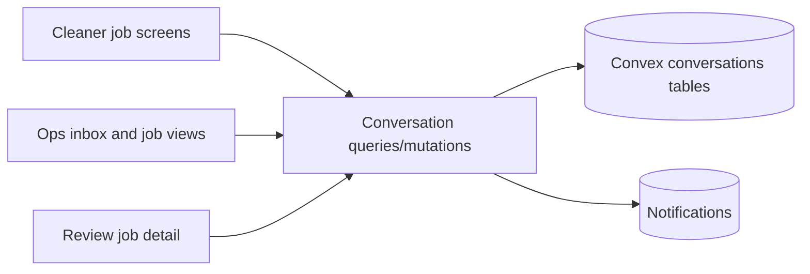
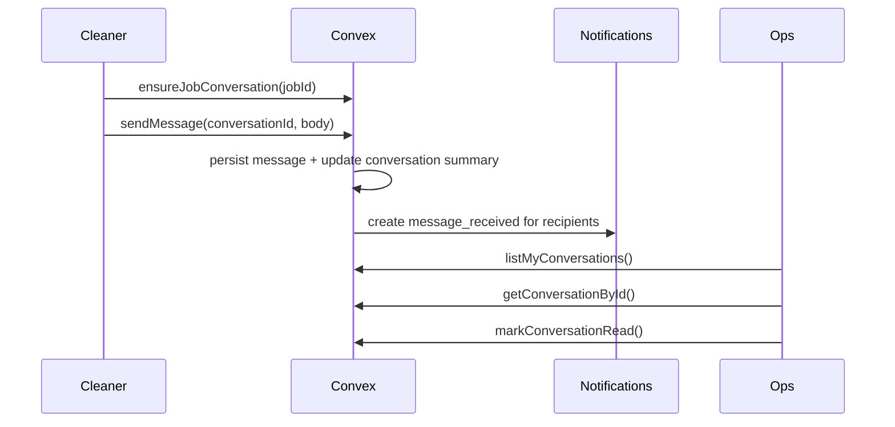
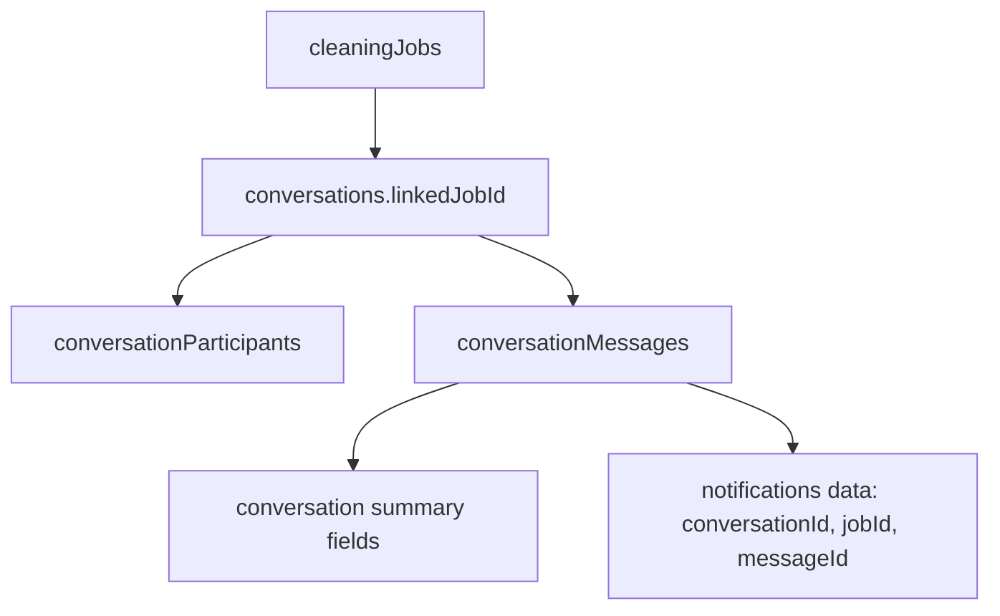

# Phase 2 Job Communications and Linked Inbox

## Context
Breezeway’s current model combines task-linked communication and a separate messaging inbox. OpsCentral currently only has one-way note fields on jobs such as `notesForCleaner`, `completionNotes`, and `managerNotes`, plus the existing notification bell and deep-link flow. There is no durable shared conversation model today.

OpsCentral Phase 2 needs to add internal job communications first, while shaping the backend for future multi-channel messaging such as SMS or WhatsApp. The shared Convex backend serves both the admin web app and the cleaners experience, so all messaging rules must live in Convex and must not duplicate business logic in Next.js.

The agreed product scope for this phase is:
- Internal-only messaging in Phase 2
- Conversation-first backend model
- One shared thread per cleaning job
- Job-linked conversations only in the UI for this phase
- Text-only messages in Phase 2

## Decision
Implement a hybrid communication system made of:
- a dedicated internal inbox at `/messages` for privileged users
- linked shared job conversations accessible from job, review, and cleaner job surfaces
- a conversation-first Convex schema designed for future channels, but using only internal threads in this phase

The system will use three new Convex tables:
- `conversations`
- `conversationParticipants`
- `conversationMessages`

Each cleaning job can have at most one linked shared conversation. That conversation persists across job rework and revision cycles. It is automatically created on first open or send, automatically reopened on new activity, and automatically marked closed when the job becomes `completed` or `cancelled`.

Unread state will be tracked per participant in `conversationParticipants.lastReadMessageAt`. Push and bell alerts will reuse the existing `notifications` table via a new `message_received` notification type. Notifications will never be the source of truth for unread thread state.

## Alternatives Considered
### Task-note fields only
Rejected because one-way note fields do not create a durable thread, participant-specific unread state, or inbox experience.

### Pure job-first schema
Rejected because the agreed direction is a conversation-first model that can later support standalone or external-channel conversations without a schema rewrite.

### Standalone conversations in Phase 2
Rejected to keep scope aligned with the immediate cleaning-job communication use case. The data model remains capable of future standalone threads, but UI creation is not exposed in this phase.

### Per-cleaner job conversations
Rejected because operations need one shared operational thread per job. Multiple threads per job would fragment context and increase notification noise.

## Implementation Plan
### Backend
Add new Convex tables in `convex/schema.ts`:
- `conversations`
  - `linkedJobId?: Id<"cleaningJobs">`
  - `propertyId?: Id<"properties">`
  - `channel: "internal" | "sms" | "whatsapp" | "email"`
  - `kind: "job" | "direct" | "group"`
  - `status: "open" | "closed"`
  - `lastMessageAt?: number`
  - `lastMessagePreview?: string`
  - `createdBy?: Id<"users">`
  - `createdAt: number`
  - `updatedAt?: number`
- `conversationParticipants`
  - `conversationId: Id<"conversations">`
  - `userId?: Id<"users">`
  - `participantKind: "user" | "external_contact"`
  - `lastReadMessageAt?: number`
  - `joinedAt: number`
  - `mutedAt?: number`
  - `createdAt: number`
  - `updatedAt?: number`
- `conversationMessages`
  - `conversationId: Id<"conversations">`
  - `authorKind: "user" | "system"`
  - `authorUserId?: Id<"users">`
  - `messageKind: "user" | "system"`
  - `channel: "internal" | "sms" | "whatsapp" | "email"`
  - `body: string`
  - `metadata?: any`
  - `createdAt: number`

Add indexes to support:
- one shared linked conversation per job
- participant lookup by user
- message retrieval by conversation and timestamp
- unread and inbox summary queries without scanning all messages

Add new Convex modules:
- `convex/conversations/queries.ts`
- `convex/conversations/mutations.ts`
- `convex/conversations/lib.ts` if helper extraction is needed

Add public functions:
- `conversations.queries.listMyConversations`
- `conversations.queries.getConversationById`
- `conversations.queries.getConversationForJob`
- `conversations.mutations.ensureJobConversation`
- `conversations.mutations.sendMessage`
- `conversations.mutations.markConversationRead`
- `conversations.mutations.closeConversation`

Conversation creation and participant seeding rules:
- `ensureJobConversation(jobId)` creates or reuses exactly one shared conversation for the job
- seed participants from:
  - assigned cleaners
  - `assignedManagerId` when present
  - property ops assignments for the job’s property
  - admin users
- allow lazy participant insertion when a privileged user with job access opens or replies to the thread

Authorization rules:
- cleaners may access only conversations linked to jobs where they are assigned
- managers and property ops may access linked conversations only when they already have job visibility under current job access patterns
- admins may access all job-linked conversations
- all writes and read checks happen in Convex

Lifecycle rules:
- when a linked job becomes `completed` or `cancelled`, close the conversation
- when a linked job returns to active work or receives a new message, reopen the conversation
- keep the same conversation attached across revision changes

Notifications:
- extend `notifications.type` with `message_received`
- reuse existing notification creation, push, header bell, and deep-link behavior
- include `conversationId`, `jobId`, and `messageId` in notification payload data
- avoid creating notifications for the author of the message

### Web App
Add a new dashboard route:
- `src/app/(dashboard)/messages/page.tsx`

Add a conversation inbox experience for privileged users:
- left pane with thread list and unread counts
- right pane with active conversation
- thread list sorted by latest message time
- display property and linked job context prominently

Add linked job conversation UI to:
- job detail page
- review job detail page

Each linked job panel should:
- lazily ensure the conversation exists
- show recent thread messages
- show unread state
- provide a fast text composer
- deep-link to `/messages?conversationId=...` for full inbox view when appropriate

Update navigation and header surfaces:
- add `Messages` to dashboard navigation for `admin`, `property_ops`, and `manager`
- optionally surface unread badge counts in navigation or thread launch points
- keep the global bell notification flow intact

### Cleaner Surfaces
Add compact conversation access to:
- cleaner job detail page
- cleaner active job flow
- optionally a lightweight `/cleaner/messages` inbox limited to assigned job conversations

Cleaner UX should remain lightweight:
- fast text-only composer
- small recent-thread preview on job surfaces
- no file attachments, reactions, editing, or deletion in this phase

### Public APIs, Interfaces, and Types
Introduce new generated Convex API entries for the conversation queries and mutations above.

Extend notification type union to include:
- `message_received`

New query response shapes should include:
- conversation summary for inbox rows
- linked job and property context
- participant list summaries
- unread flag or unread count derived from participant read state
- message timeline with author display data

## Risks and Mitigations
- Participant over-notification
  - Mitigation: seed from job/property ownership rules only, dedupe recipients, and exclude author notifications.
- Read-state contention
  - Mitigation: keep per-user read state in `conversationParticipants` instead of patching the conversation document on every read.
- Shared-backend compatibility risk
  - Mitigation: keep all message access and lifecycle logic in Convex and validate against both admin and cleaner entry points.
- Scope creep into a full messaging platform
  - Mitigation: Phase 2 remains text-only, internal-only, and job-linked only.

## High-Level Diagram (ASCII)
```text
Cleaner UI ──┐
             ├── linked job conversation ── Convex ── inbox + notifications ── Ops UI
Review UI ───┘
```

## Architecture Diagram (Mermaid)


## Flow Diagram (Mermaid)


## Data Flow Diagram (Mermaid)


## Business Diagram (Excalidraw)

Create a companion Excalidraw artifact for business sharing.

- Companion file: `docs/2026-04-08-phase-2-job-communications-and-linked-inbox-plan.excalidraw.md`
- Keep it top-level and audience-friendly.

---
Saved from Codex planning session on 2026-04-08 21:52.
