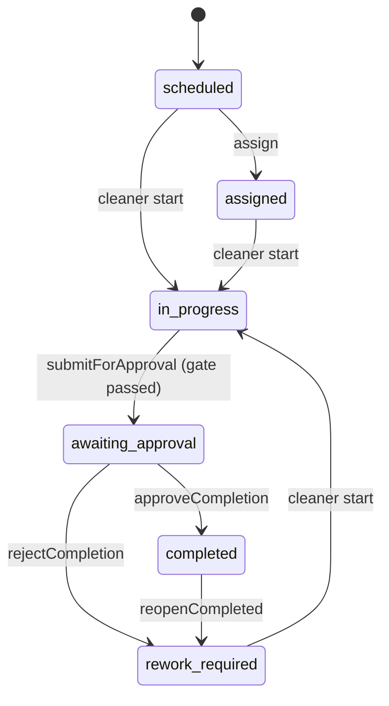

# Cleaning Execution State Machine and Revisions

## Canonical Durable States
- `scheduled`
- `assigned`
- `in_progress`
- `awaiting_approval`
- `rework_required`
- `completed`
- `cancelled` (terminal outside standard approval/rework loop)

## Revision Rules
- `currentRevision` is tracked on `cleaningJobs`.
- Every submit seals evidence for the active revision.
- Every reject/reopen increments `currentRevision` and opens a new rework cycle.
- Previous submission records remain immutable snapshots in `jobSubmissions`.

## Normative Transition Table
| From | Event | Guard | To | Side Effects |
|---|---|---|---|---|
| `scheduled` | assign cleaners | valid cleaners exist | `assigned` | `assignedCleanerIds` updated |
| `scheduled` | cleaner start | cleaner authorized | `in_progress` | create/update execution session; set `actualStartAt` if empty |
| `assigned` | cleaner start | cleaner authorized | `in_progress` | create/update execution session; set `actualStartAt` if empty |
| `rework_required` | cleaner start | cleaner authorized | `in_progress` | create/update execution session for current revision |
| `in_progress` | submit for approval | all assigned sessions are `submitted`/`excused` or privileged force | `awaiting_approval` | seal submission snapshot, set `latestSubmissionId`, set `actualEndAt` if empty |
| `awaiting_approval` | approve | approver role | `completed` | set `approvedAt`, `approvedBy` |
| `awaiting_approval` | reject | approver role | `rework_required` | increment revision, supersede latest submission reference, reset active timing |
| `completed` | reopen | approver role | `rework_required` | increment revision, supersede latest submission reference, reset active timing |

## Forbidden Transitions
- `completed -> in_progress` directly.
- `scheduled -> awaiting_approval` directly.
- `in_progress -> completed` directly.
- `awaiting_approval -> assigned` directly.

## ASCII State Diagram
```text
scheduled
   |
assigned
   |
in_progress (rev N)
   |  submitForApproval (gate: all sessions submitted/excused)
   v
awaiting_approval (rev N sealed)
   | approve
   v
completed
   | reopen(reason)
   v
rework_required (rev N+1 open)
   |
   +--> in_progress (rev N+1) --> awaiting_approval --> completed

Reject path:
awaiting_approval --reject(reason)--> rework_required (rev N+1 open)
```

## Mermaid State Diagram


## Rejection, Resubmission, and Reopen Semantics
- Reject from `awaiting_approval`:
  - Create new open revision (`N+1`).
  - Preserve revision `N` snapshot immutable.
  - Job re-enters work through `rework_required -> in_progress`.
- Reopen from `completed`:
  - Same revision bump and immutable history behavior as reject.
  - New execution sessions are written against revision `N+1`.
- Resubmission:
  - Happens from `in_progress` for the active revision.
  - New `jobSubmissions` record is sealed and linked via `latestSubmissionId`.

## Session Gate Rules
- Each assigned cleaner must be represented by a revision-scoped session record.
- Gate passes only if each assigned cleaner session is `submitted` or `excused`.
- If gate fails, mutation returns unresolved cleaner IDs and does not transition state.
