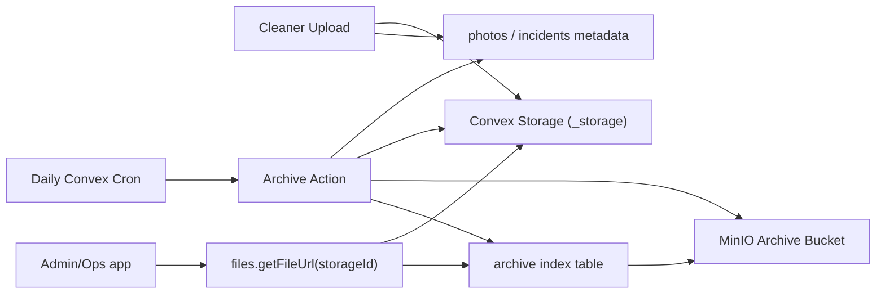
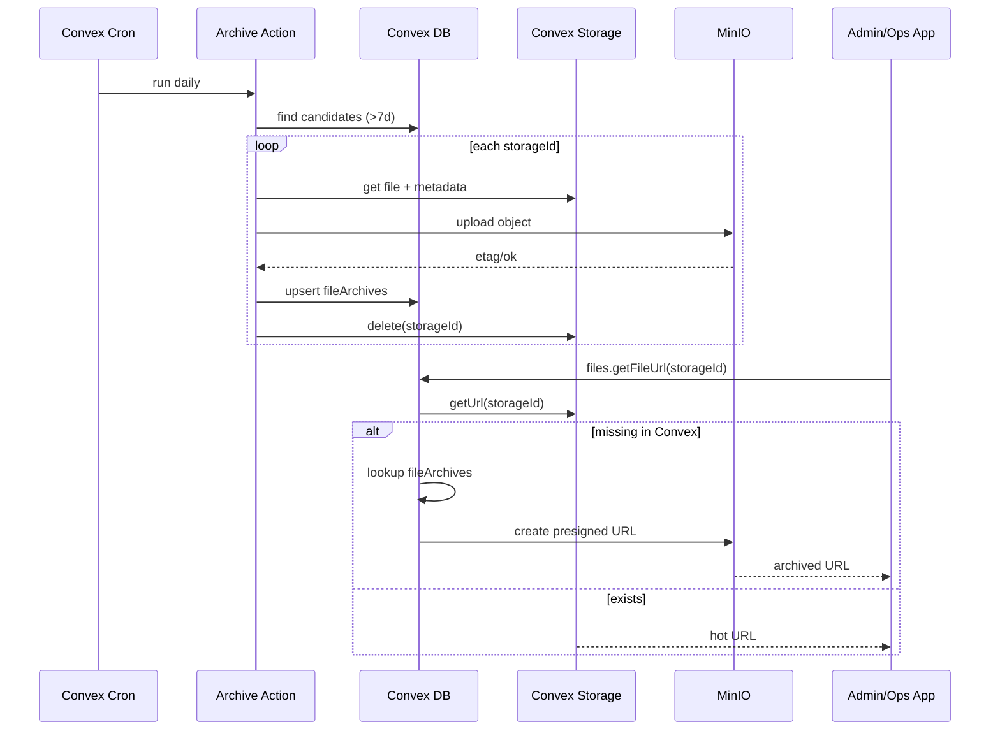
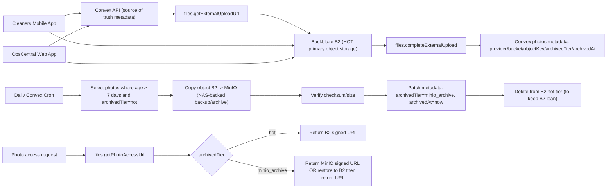
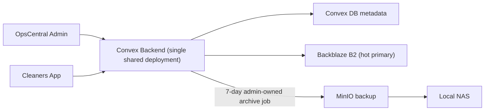

## Convex-to-MinIO Photo Archiving Plan (7-Day Hot Tier)

### Summary

- Current photo storage is fully in Convex file storage with no retention cron, and uploaded images are still relatively large (`quality: 0.7` camera captures are commonly ~1.2–1.5MB each in repo samples).
- Selected policy:

1. Keep photos hot in Convex for **7 days**.
2. Run archive job via **daily Convex cron**.
3. Archive scope: **job photos + incident photos**.
4. Retrieval mode: **direct MinIO viewing + optional restore**.
5. Delete from Convex **immediately after verified archive**.

- Target outcome: keep Convex file usage under free-tier constraints while preserving access to old cases.

### Implementation Changes

- Backend changes centered in [convex/files/mutations.ts](/Users/atem/sites/jnabusiness_solutions/apps-ja/jna-cleaners-app/convex/files/mutations.ts), [convex/files/queries.ts](/Users/atem/sites/jnabusiness_solutions/apps-ja/jna-cleaners-app/convex/files/queries.ts), and [convex/crons.ts](/Users/atem/sites/jnabusiness_solutions/apps-ja/jna-cleaners-app/convex/crons.ts).
- Add new Convex table `fileArchives` keyed by original `storageId`, including source type (`photo` or `incident_photo`), source record id, MinIO object key, checksum/size, archivedAt, status, lastError.
- Add internal archive action (idempotent batch) to:

1. Select candidates older than 7 days from `photos` and `incidents.photoIds`.
2. Skip items already in `fileArchives` with status `archived`.
3. Read file + metadata from Convex storage, upload to MinIO, verify checksum/size.
4. Insert/update `fileArchives` record.
5. Delete file from Convex storage immediately only after verification.

- Add daily cron trigger for archive action.
- Extend `files.getFileUrl(storageId)` behavior:

1. Return Convex URL if file still hot.
2. If missing in Convex, resolve `fileArchives` and return MinIO pre-signed URL.

- Add optional admin-only restore mutation:

1. Restore one file or all files for a job.
2. Re-upload to Convex storage, patch references (`photos.storageId`, `incidents.photoIds`), mark archive row restored.

- Add upload optimization in [hooks/useConvexFileUpload.ts](/Users/atem/sites/jnabusiness_solutions/apps-ja/jna-cleaners-app/hooks/useConvexFileUpload.ts): resize/compress before upload (target max dimension + lower quality) to reduce future storage/bandwidth growth.

### Public Interfaces and Config

- New internal action: `internal.files.archiveDaily`.
- New admin mutation(s): `files.restoreArchivedFile`, `files.restoreArchivedFilesForJob`.
- New admin query: archive stats/list for UI reporting.
- New env vars: `MINIO_ENDPOINT`, `MINIO_REGION`, `MINIO_BUCKET`, `MINIO_ACCESS_KEY`, `MINIO_SECRET_KEY`, optional `MINIO_FORCE_PATH_STYLE`, `MINIO_PRESIGN_TTL_SECONDS`.

### Test Plan

- Convex tests:

1. Candidate selection for both `photos` and `incidents.photoIds`.
2. Idempotent reruns do not duplicate archive rows.
3. Failed MinIO upload never deletes Convex file.
4. Verified archive deletes Convex file and records checksum/size.
5. `getFileUrl` fallback returns MinIO URL when Convex file is gone.
6. Restore updates references and restores access.

- Manual QA:

1. Ops review screen loads archived photos transparently.
2. Admin can restore an archived job and view via Convex path again.
3. Daily cron logs/reporting show counts, bytes moved, failures.

### Assumptions and Defaults

- MinIO infrastructure and credentials will be provided before enabling delete mode.
- Rollout will be staged: dry-run archive mode first, then enable deletion.
- `opscentral-admin` (separate repo) will consume new archive stats/restore APIs for admin controls.
- Shared Convex/Clerk architecture remains unchanged (`usable-anaconda-394`, same Clerk issuer).
