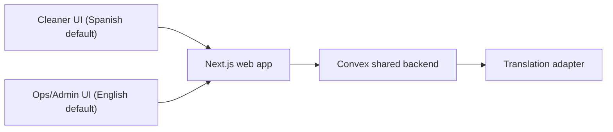
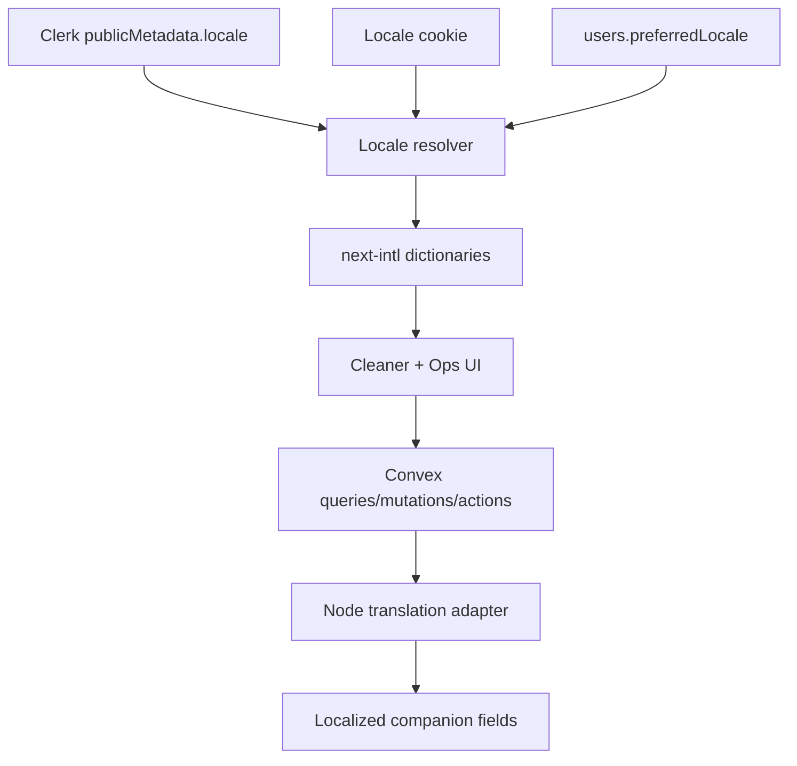
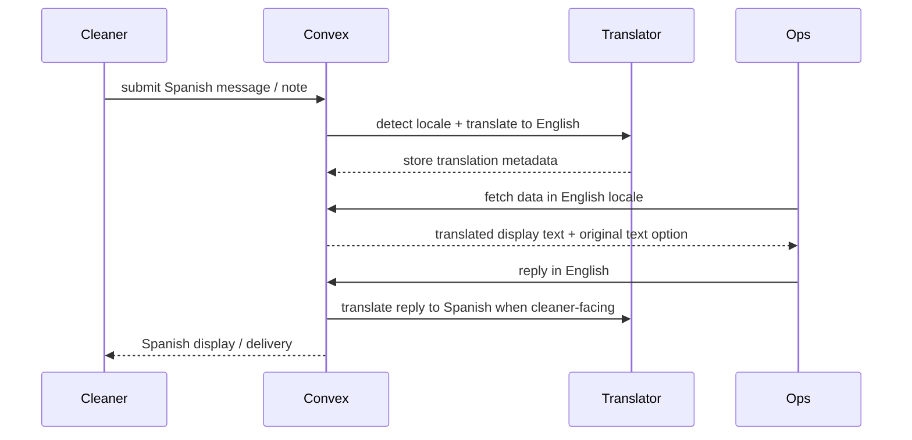
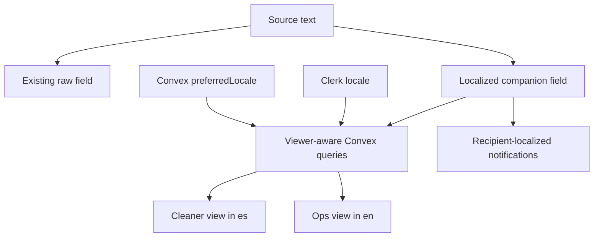

# Bilingual Cleaner Experience and Cross-Language Communications

## Context
- OpsCentral currently has no i18n framework, no language switcher, and hardcoded English copy across cleaner and ops/admin surfaces.
- Spanish is the primary language for cleaners, while ops/admin users work in English.
- The app already supports internal job conversations and WhatsApp cleaner lanes, but `conversationMessages` currently store a single raw `body` with no translation metadata.
- Cleaner-authored free text also appears outside the inbox, including incident titles/descriptions and completion notes, so bilingual communication cannot be solved at the inbox layer alone.
- The Convex backend is shared with the cleaners mobile app, so all translation and locale behavior must be additive and backend-safe.

## Decision
- Support exactly two locales in v1: English (`en`) and Spanish (`es`).
- Roll out whole-app localization, but sequence delivery as foundation first, then cleaner surfaces, then bilingual communications, then the rest of ops/admin surfaces.
- Default cleaners to Spanish and ops/admin users to English, with a persistent in-app language override for every user.
- Use `next-intl` for App Router UI localization with cookie-based locale selection and no locale-prefixed URLs.
- Persist locale in both Clerk `publicMetadata.locale` and Convex `users.preferredLocale`, with Clerk acting as the auth/server-render source and Convex acting as the backend/workflow source.
- Use an OpenAI-backed translation adapter behind a Convex Node action boundary for v1.
- Store original text plus translated companions for new content only. Do not backfill historical data in v1.
- If a viewer’s locale differs from the source locale, show the translated version as primary and allow the original text to be revealed on demand.

## Alternatives Considered
### Cleaner-only UI localization
- Rejected as the final target because the user wants whole-app localization if feasible.
- Retained only as the rollout order, not as the scope boundary.

### Manual translation button only
- Rejected because day-to-day operations require cleaners to write naturally in Spanish while ops/admin can immediately read English.

### Locale-prefixed routes
- Rejected because this is an authenticated internal app, not a public SEO-driven site. Stable route structure is more important than localized URLs.

### Separate translations table
- Rejected for v1 because hot-path conversation and review queries would become more complex, while additive localized companion fields keep compatibility simpler for the shared backend.

## Implementation Plan
### 1. Locale foundation
- Add `next-intl` and `@clerk/localizations`.
- Introduce shared locale config for `en` and `es`, dictionary files, and request-time locale resolution from cookie plus authenticated preference.
- Update the root layout to set `<html lang>` dynamically instead of hardcoding `en`.
- Add a single locale helper layer for labels, date/time formatting, number formatting, and status text instead of scattered inline `toLocaleString` and hardcoded strings.

### 2. User preference model
- Extend the `users` table with `preferredLocale?: "en" | "es"`.
- Add Convex queries/mutations to read and update locale preference.
- Extend Clerk user sync to read and write `publicMetadata.locale`.
- Extend team-member creation/import/backfill flows so new and existing users receive role-based defaults:
  - cleaners => `es`
  - admin, property_ops, manager => `en`
- Use precedence:
  - explicit saved user preference
  - locale cookie
  - route default based on role/surface

### 3. Cleaner-first UI localization
- Localize cleaner auth, shell, navigation, notifications UI, home, active job flow, incidents flow, messages, more, and settings.
- Add a persistent language switcher in cleaner settings.
- Ensure the switcher updates the locale cookie, Clerk metadata, and Convex preference in one flow.
- Keep cleaner routes server-component-first and push client-only translation consumption down where needed.

### 4. Cross-language communication model
- Add a reusable localized content shape for backend-managed translated text:
  - `sourceLocale`
  - `sourceText`
  - `translations.en?`
  - `translations.es?`
  - `status`
  - `translatedAt?`
  - `provider?`
- Extend new-content fields only with additive localized companions:
  - `conversationMessages.bodyLocalized`
  - `incidents.titleLocalized`
  - `incidents.descriptionLocalized`
  - `cleaningJobs.notesForCleanerLocalized`
  - `cleaningJobs.completionNotesLocalized`
- Keep existing raw string fields for compatibility with other app consumers.

### 5. Translation pipeline
- Add a Convex Node translation adapter module with:
  - source-language detection
  - English/Spanish translation
  - translation-status recording
  - graceful fallback when translation is unavailable
- Internal messages, incident reports, and completion notes may write the source text first and complete translation asynchronously.
- Cleaner-facing outbound text that must be shown immediately in Spanish should be translated before send when needed.
- WhatsApp reply flows should translate ops-authored English into Spanish before outbound delivery to cleaner-facing lanes.

### 6. Conversation and notes query behavior
- Update conversation queries to return viewer-ready fields instead of only the raw body:
  - `displayBody`
  - `originalBody`
  - `sourceLocale`
  - `isAutoTranslated`
  - localized preview text for inbox rows
- Apply the same viewer-locale logic to incident detail, review detail, and completion-note surfaces.
- Display translated text as primary when viewer locale differs from source locale.
- Expose a `Show original` control for transparency and auditability.

### 7. Notification localization
- Refactor notifications so `title` and `message` are rendered per recipient locale from translation keys and params rather than one shared English string.
- Ensure cleaner notifications use Spanish by default and ops/admin notifications use English by default.
- Keep notification deep-link behavior unchanged.

### 8. Ops/admin UI localization
- Localize dashboard navigation, header/sidebar, jobs, review, messages, schedule, properties, team, settings, reports, inventory, and work-orders surfaces.
- Add the same persistent language switcher to ops/admin settings or the global shell.
- Keep the ops default in English, but allow Spanish override for any role.

### 9. Compatibility and rollout safety
- Keep all raw text fields intact during v1 rollout.
- Run owner-repo Convex changes only from this repo.
- After backend changes, run mobile compatibility checks and sync the cleaners mirror repo.
- If translation provider configuration is missing, UI localization still ships and communication surfaces fall back to original text with an explicit “translation unavailable” state.

## Risks and Mitigations
- Translation errors could obscure operational meaning.
  - Mitigation: store original text, expose `Show original`, and never overwrite the source.
- Shared-backend changes could break the cleaners mobile app.
  - Mitigation: additive schema only, compatibility verification, and mirror sync after backend changes.
- Notification copy could remain partially English if templates are not centralized.
  - Mitigation: convert notification generation to locale-aware templates instead of inline strings.
- Localizing the whole app could become a large UI sweep.
  - Mitigation: deliver in phases with cleaner-critical surfaces first while still building a whole-app foundation.

## High-Level Diagram (Mermaid)

## Architecture Diagram (Mermaid)

## Flow Diagram (Mermaid)

## Data Flow Diagram (Mermaid)

