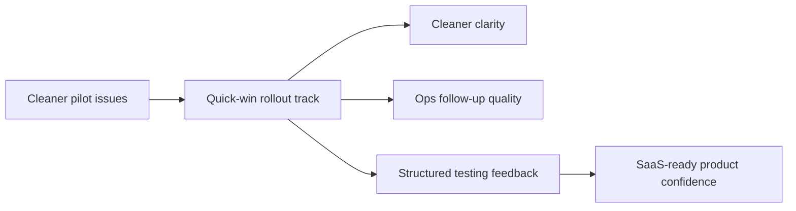
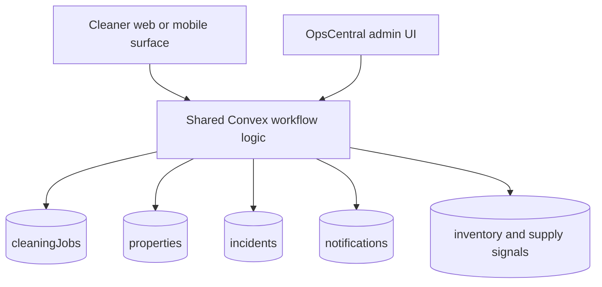
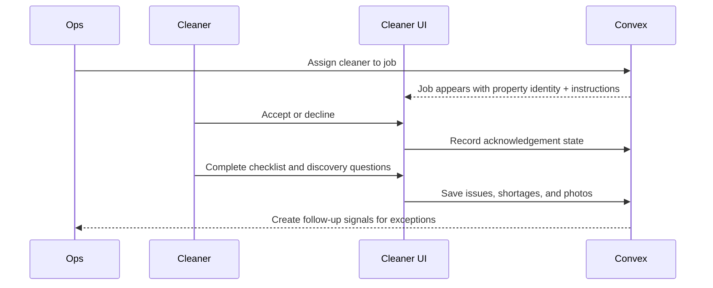
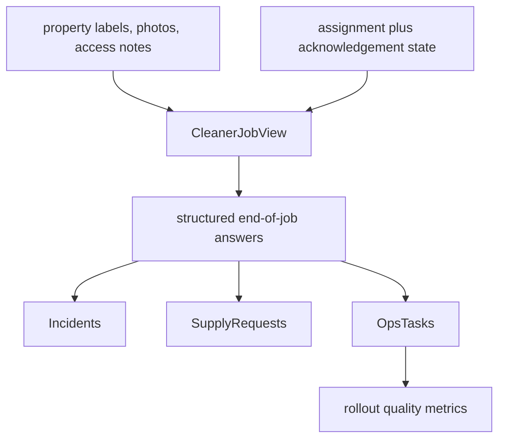

# Cleaner Rollout Quick Wins and Testing Plan

## Context
OpsCentral already has the shared Convex backend, role model, and a substantial portion of the cleaner workflow in place. The April 19, 2026 meeting made it clear that the next constraint is no longer architecture discovery; it is operational readiness for real team testing.

The immediate pain points are concrete and repeated:
- cleaners still confuse properties with similar setups
- reminders are too fragmented across WhatsApp, Hospitable, and memory
- supply and breakage reporting is inconsistent
- access instructions and property reference context are not consistently available at the point of work
- operations need fast feedback loops while the team begins testing now, not after a larger rewrite

At the same time, there is new sales pressure. Haseeb already has a potential 80-property lead, which means the product needs a credible path from single-company rollout to multi-company SaaS. That should influence architecture decisions, but it must not block the rollout fixes required for immediate field testing.

## Decision
Split execution into two tracks:

1. Track A: a quick-wins rollout plan focused on cleaner testing, operational clarity, and fast issue reduction in the current single-company deployment.
2. Track B: a separate SaaS foundation plan that hardens tenancy, onboarding, and account isolation without slowing down Track A.

For this document, prioritize Track A and sequence work into small, testable slices that can ship while the team is actively using the product.

Guiding rules:
- keep business logic in Convex
- keep frontend changes thin and workflow-oriented
- prefer additive schema changes only
- optimize for confusion reduction, not feature breadth
- do not wait for enterprise or SaaS work before improving team testing quality

## Alternatives Considered
### Pause rollout until SaaS foundations are defined
Rejected because the team needs to start testing immediately and the meeting notes show several issues that can be reduced with small, tactical product changes.

### Keep using WhatsApp and manual reminders as the primary operational system
Rejected because the confusion around Berlin vs. Skagen and fragmented reminders is already causing assignment mistakes.

### Build broad new modules before fixing the top field issues
Rejected because the highest-value gaps are already known. The team needs better execution clarity more than new surface area.

## Implementation Plan
### Phase 0: Stabilize test rollout this week
Goal: remove the most common causes of cleaner confusion before adding broader automation.

1. Cleaner-facing property identity hardening
- Add cleaner-facing property display labels that emphasize address, nickname, and bed count together.
- Surface a property hero card on cleaner job views with:
  - address
  - short label used internally
  - bed/bath summary
  - cover/reference photo
  - access summary
- Add a lightweight warning treatment for properties commonly confused with each other.
Success metric: fewer wrong-property arrivals during pilot testing.

2. Access instructions and reference context
- Add a dedicated job section for:
  - entry instructions
  - key location
  - parking notes
  - urgent property notes
  - reference photos for entrance or critical areas
- Make this visible before the cleaner starts the job, not buried at the end.
Success metric: fewer clarification messages before arrival.

3. Structured accept/decline flow with expiry
- Add explicit cleaner actions for accept and decline.
- Add expiry or reminder escalation if a job remains unacknowledged.
- Notify ops when a cleaner declines or does not respond in time.
- Keep assignment logic in Convex so the same workflow can later support mobile and web consistently.
Success metric: faster assignment certainty and less manual chasing.

4. Post-clean discovery questions
- Add a required end-of-job prompt for a short fixed set of discovery questions:
  - anything broken?
  - any supply shortages?
  - anything not functioning properly?
  - anything ops should review before next guest?
- Keep answers structured with optional notes and photos.
- Route critical answers into incident or follow-up task creation.
Success metric: fewer silent issues carried into the next reservation.

5. Supply reporting quick fix
- Replace freeform supply reporting with a guided input that asks for:
  - item type
  - quantity or severity
  - optional photo
- Start with the small list repeatedly mentioned in operations: towels, kitchen towels, paper goods, soap, linens, and refillable consumables.
Success metric: fewer ambiguous refill requests and less back-and-forth.

### Phase 1: Operational clarity improvements
Goal: tighten the daily loop between cleaner execution and ops follow-up.

1. Ops reminder tasks
- Add custom reminder tasks for ops users.
- Use them for follow-up items discussed in the meeting, such as checking outdoor TV, chair stability, pest follow-up, or hot-tub-related prep.
- Keep these internal-only and lightweight.

2. Cleaner job summary and next-action states
- Improve cleaner home and job list views so each assignment shows:
  - property identity
  - scheduled window
  - current status
  - acceptance state
  - missing action badge if instructions, checklists, or evidence remain incomplete

3. Property checklist polish
- Prioritize section and room checklist clarity for the highest-risk items from current operations.
- Add typed “check this every time” prompts for items repeatedly missed in the field.
- Start with broken furniture, missing slippers, hot tub readiness context, trash overflow, and essential appliance checks.

4. Photo reference improvements
- Distinguish between operational reference photos and execution proof photos.
- Operational references help the cleaner find and identify the property.
- Execution proof remains before/after or incident evidence.

### Phase 2: Pilot hardening and operational controls
Goal: make the pilot credible for broader company use.

1. Draft versus commit discipline
- Where notification or downstream operational effects exist, prefer draft capture before broader alerts.
- Let ops review high-risk items before notifying staff or external parties.

2. Review queue for exceptions
- Centralize incidents, declines, unresolved supply shortages, and failed checklist items into an ops review queue.
- Keep this queue focused on actionability rather than analytics.

3. Basic measurement for rollout quality
- Add internal reporting for:
  - accepted jobs versus declined jobs
  - late acknowledgements
  - repeated incidents by property
  - top supply shortage types
  - jobs with missing end-of-job responses
- Use this to determine when pilot testing is stable enough for a larger external rollout.

### Delivery order
Ship in this order to maximize quick wins:
1. Property identity hardening
2. Access instructions and reference context
3. Accept/decline with expiry alerts
4. Post-clean discovery questions
5. Structured supply reporting
6. Ops reminder tasks
7. Pilot hardening queue and metrics

### Suggested execution cadence
Week 1:
- property identity hardening
- access instructions and reference context
- post-clean discovery questions

Week 2:
- accept/decline with expiry alerts
- structured supply reporting
- ops reminder tasks

Week 3:
- exception review queue
- rollout quality metrics
- cleanup based on live tester feedback

## Risks and Mitigations
- Risk: quick fixes turn into one-off UI patches.
- Mitigation: keep the rules in Convex and make each quick win reusable by both the web admin and cleaner-facing surfaces.

- Risk: rollout work gets blocked by future SaaS concerns.
- Mitigation: treat SaaS as a separate architecture track with clear boundaries; only make immediate changes that are additive and tenant-compatible.

- Risk: too many fields slow cleaners down.
- Mitigation: keep required inputs short, mobile-first, and tied to the moments where the missing information currently causes rework.

- Risk: notifications become noisy.
- Mitigation: use explicit escalation rules and avoid turning every field change into an alert.

## High-Level Diagram (Mermaid)

## Architecture Diagram (Mermaid)

## Flow Diagram (Mermaid)

## Data Flow Diagram (Mermaid)

