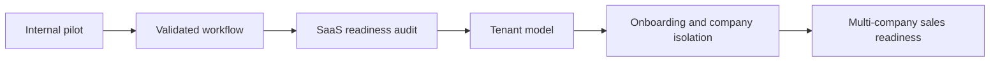
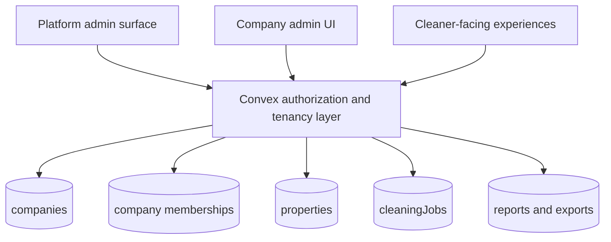
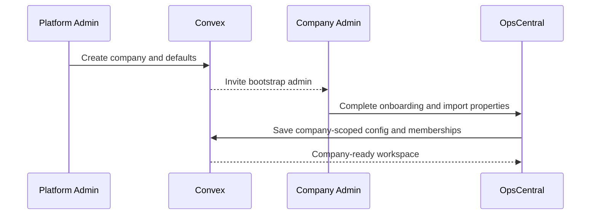
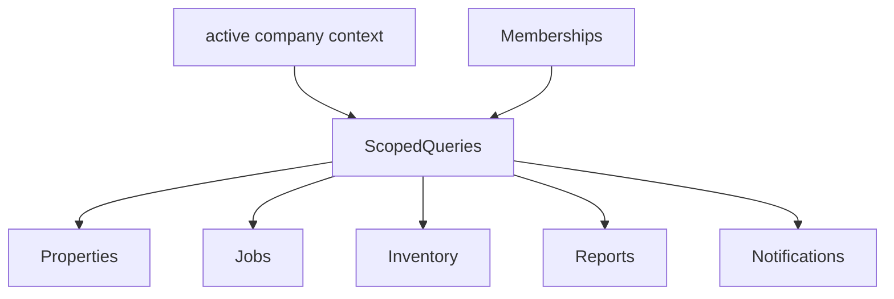

# Multi-Company SaaS Foundations

## Context
During the same April 19, 2026 discussion, a new commercial requirement emerged: Haseeb already has a potential client with roughly 80 properties and wants the product to be pitchable when the time is right. That changes the product horizon.

OpsCentral is currently organized around one operating company, one shared Convex deployment, and one set of workflows shaped around J&A operations. The current product can still become a SaaS offering, but only if tenant boundaries, onboarding, and organization-aware permissions are designed deliberately.

The key planning constraint is sequencing. The team needs immediate rollout fixes now, while the SaaS and enterprise work should be phased in without destabilizing the current pilot.

## Decision
Treat SaaS enablement as a separate program after immediate rollout quick wins, but start making tenant-safe architectural decisions now.

The SaaS direction should be:
- multi-company, single platform
- organization-aware roles and team membership
- property, job, inventory, and reporting data scoped by company
- onboarding flows that can provision a new company without manual backend surgery
- no recoupling of business logic into Next.js; tenancy and authorization remain in Convex

This should be executed as a phased roadmap, not a prerequisite for current tester fixes.

## Alternatives Considered
### Clone the app per company
Rejected because that creates operational sprawl, inconsistent deployments, and duplicated onboarding effort.

### Ship current single-company architecture to outside customers first
Rejected because data isolation, permissions, and onboarding debt would become harder to unwind after external adoption.

### Pause all current testing until multi-tenant support is complete
Rejected because the product still needs real operational validation from the internal team before broader commercialization.

## Implementation Plan
### Phase 0: SaaS readiness audit
Goal: identify where the current model is implicitly single-company.

1. Audit all shared entities for tenant assumptions
- properties
- cleaning jobs
- users
- teams
- inventory
- work orders
- conversations or notifications
- reports and exports

2. Classify each area as one of:
- already tenant-safe
- additive company scoping needed
- incompatible with multi-company and requires redesign

3. Produce a blast-radius map for current Convex functions and indexes.

### Phase 1: Company and team domain model
Goal: establish the minimum tenant model.

1. Introduce core entities
- companies or organizations
- company memberships
- teams within a company
- optional company settings surface

2. Define role scoping
- platform-level admin only when absolutely necessary
- company admin
- property ops
- manager
- cleaner

3. Attach company scope to core operational data
- properties belong to one company
- jobs belong to a property and therefore a company
- inventory, work orders, incidents, and reports inherit company scope

4. Add Convex authorization helpers that enforce company membership before role checks.

### Phase 2: Multi-company onboarding
Goal: make it possible to add a new company predictably.

1. Provisioning flow
- create company
- create initial admin user or invite flow
- create default teams
- seed settings and status defaults
- optionally import properties and staff

2. Guided setup experience
- company profile
- operating regions and time zone
- property import
- user invites
- checklist template defaults
- scheduling rule defaults

3. Property import and mapping
- CSV import or guided admin entry
- standardized address and naming rules
- support internal nickname plus public-facing cleaner label

### Phase 3: Tenant-safe product surfaces
Goal: ensure every major workflow respects tenant scope.

1. Dashboard and schedule
- never aggregate across companies unless explicitly using a platform-admin surface
- default queries scoped to active company context

2. Messaging, notifications, and reports
- notifications scoped by company membership
- no cross-company participant leakage
- exports and owner reports generated within company context

3. File and photo handling
- ensure uploaded assets are attributable to company and property context
- maintain clear auditability for external customers

### Phase 4: Commercialization and enterprise controls
Goal: make the product sellable to outside operators.

1. Branded onboarding and account management
- company branding basics
- invite and membership management
- plan-aware settings exposure

2. Enterprise-ready controls
- audit logs for high-risk actions
- stronger permissions around approvals and exports
- support for internal operating teams versus client-facing owner users

3. Supportability
- company-level diagnostics
- onboarding checklist status
- safer configuration management for templates and scheduling rules

### Recommended sequencing against current rollout
1. Do not block quick wins on multi-tenant implementation.
2. During quick-win work, avoid adding new tables or functions that assume a single company forever.
3. Start the SaaS readiness audit as soon as Phase 0 quick wins are underway.
4. Only begin tenant model implementation after pilot testing validates the core cleaner workflow.

### Suggested thread split
Use separate planning and execution threads:
- Thread A: internal rollout quick wins and pilot stabilization
- Thread B: SaaS foundations, tenant model, and onboarding architecture

That separation keeps delivery honest. Track A is about operational pain reduction. Track B is about productization.

## Risks and Mitigations
- Risk: tenancy is bolted on after more single-company assumptions are added.
- Mitigation: start with an audit and company-scope rules before expanding into more customer-facing modules.

- Risk: the team overbuilds for enterprise before the core workflow is proven.
- Mitigation: require pilot success gates before major commercialization work.

- Risk: shared backend changes break current operations.
- Mitigation: keep SaaS groundwork additive, staged, and validated against the existing internal rollout.

- Risk: onboarding becomes heavily manual.
- Mitigation: prioritize a provisioning flow and import path early in the SaaS roadmap.

## High-Level Diagram (Mermaid)

## Architecture Diagram (Mermaid)

## Flow Diagram (Mermaid)

## Data Flow Diagram (Mermaid)

