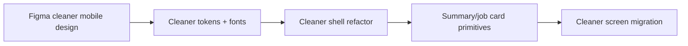
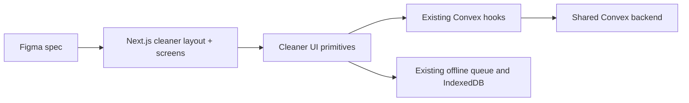
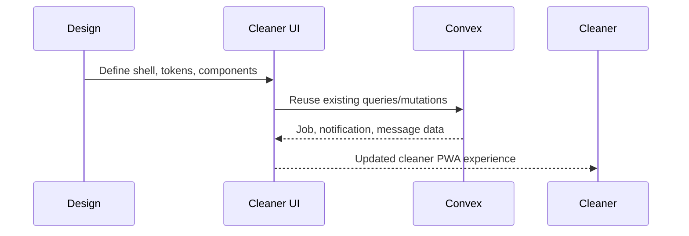
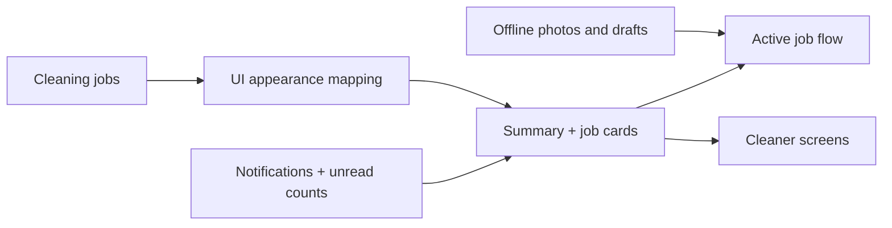

# Cleaner PWA UI Migration From Figma

## Context

OpsCentral has a desktop admin dashboard and a separate cleaner PWA. The linked Figma file `p4QZuqomX8KusfMQkzFQec` is mobile-first and maps directly to the `/cleaner` experience, including the home/start surface, bottom navigation, incident flow, messages, history, settings, and reusable summary/job-card components.

The current cleaner experience already uses the right routes and Convex-backed data flows, but it diverges from the Figma in tokens, typography, shell composition, and mobile hierarchy.

## Decision

Phase 1 migrates the cleaner PWA visual layer to the Figma design while preserving all current Convex queries, mutations, route structure, and offline data flows. The implementation is token-first, then shell-first, then screen/component migration.

Typography for the cleaner surface uses `Spectral`, `Montserrat`, and `Atkinson Hyperlegible`, scoped to the cleaner layout only.

## Alternatives Considered

Keep Geist for the cleaner PWA:
Rejected because it leaves the mobile UI visibly off-spec.

Redesign desktop and cleaner surfaces together:
Rejected because the current Figma source of truth is cleaner/mobile-specific.

Skip token cleanup and only patch screens:
Rejected because it would preserve styling drift and make later screens inconsistent.

## Implementation Plan

1. Add cleaner-scoped visual tokens and typography variables in global CSS.
2. Load cleaner fonts in the cleaner layout only.
3. Introduce reusable cleaner presentation components for summary cards, job cards, pills, and icon buttons.
4. Refactor the cleaner shell to match the Figma top bar, mobile chrome, and floating bottom navigation.
5. Re-skin the primary cleaner screens while keeping existing Convex and offline behavior intact.
6. Validate with targeted linting and regression checks, while noting existing repo-wide lint/test debt separately.

## Risks and Mitigations

Cleaner typography or tokens may leak into the desktop admin UI.
Mitigation: cleaner variables and font usage are scoped to the cleaner layout and cleaner utility classes.

Visual changes may accidentally alter business behavior.
Mitigation: preserve all current data hooks, routes, and mutation/query contracts; restrict changes to presentation and UI state wiring.

The repo has unrelated lint/test failures that can obscure migration validation.
Mitigation: use targeted lint on changed files and report unrelated baseline failures separately.

## High-Level Diagram (Mermaid)

## Architecture Diagram (Mermaid)

## Flow Diagram (Mermaid)

## Data Flow Diagram (Mermaid)

---
Saved from Codex planning session on 2026-04-11 21:49.
