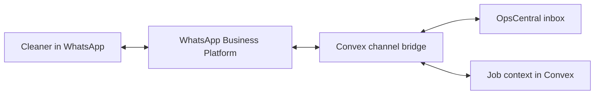
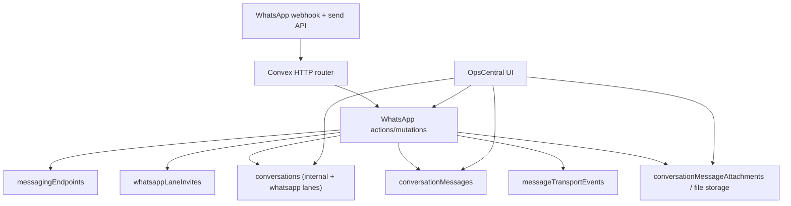
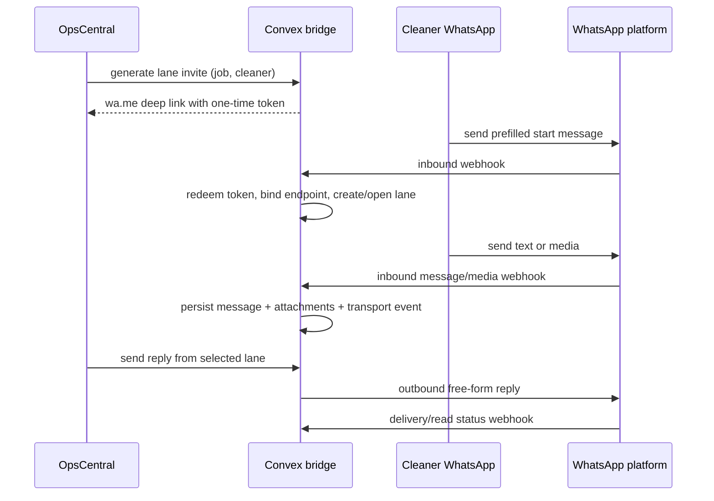
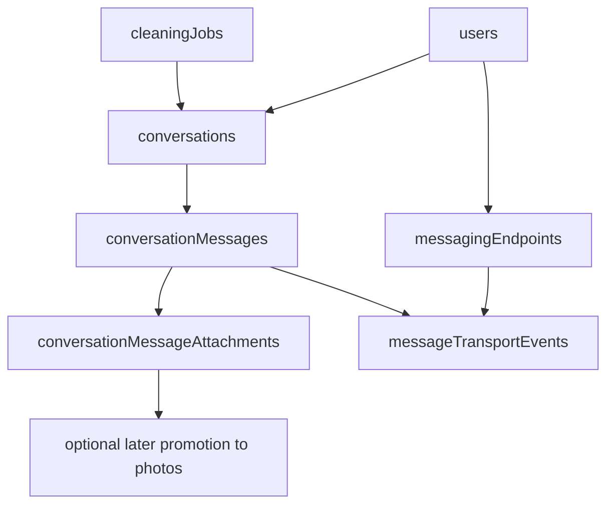

# WhatsApp Cleaner Communications Bridge

## Context

OpsCentral already has a Phase 2 internal messaging model in Convex, but WhatsApp adds a hard constraint: business messaging is 1:1 per phone number, while current job chat is one shared thread per job. The next phase should let cleaners stay in WhatsApp, let ops reply from OpsCentral, and keep Convex as the source of truth.

This phase is scoped to:

- cleaners + ops only
- job-linked communication only
- ops replies from OpsCentral only
- text plus photos/documents
- inbound/outbound only inside active customer-service windows
- chat attachments first, with explicit promotion to job evidence later

## Decision

Use **direct WhatsApp Business Platform / Meta Cloud API** as the production path, with all webhook and channel logic owned in Convex.

Architecturally:

- keep the existing **internal shared job conversation**
- add **separate WhatsApp lanes per cleaner per job** as additional conversation records under the same job context
- treat each WhatsApp lane as a 1:1 mirror between OpsCentral and one cleaner phone
- bootstrap each lane with a **job-specific one-time WhatsApp deep link token**
- keep WhatsApp media as **conversation attachments**, not automatic QA evidence
- block outbound app replies when the 24-hour window is closed; show lane status instead of silently failing

This preserves the current internal messaging model, avoids template-heavy rollout in v1, and is the cheapest production path.

## Alternatives Considered

- **Managed provider first (Twilio):** fastest onboarding, but not the cheapest steady-state path. As of **April 10, 2026**, Twilio’s Sandbox is for testing only and sandbox traffic is still billed at standard WhatsApp rates; Twilio production pricing adds **$0.005/message** inbound or outbound, and Twilio Conversations adds per-active-user pricing on top of channel rates ([Sandbox](https://www.twilio.com/docs/whatsapp/sandbox), [WhatsApp pricing](https://www.twilio.com/en-us/whatsapp/pricing), [Conversations pricing](https://www.twilio.com/en-us/messaging/pricing/conversations-api), [Self Sign-up](https://www.twilio.com/docs/whatsapp/self-sign-up)).
- **WhatsApp BSP middle path:** viable later if Meta onboarding becomes the blocker, but it still adds vendor coupling without materially simplifying the domain model.
- **Unofficial WhatsApp Web automation:** reject outright for reliability/account-risk reasons.
- **Single shared WhatsApp thread per job:** not viable because WhatsApp business messaging is 1:1, so multi-cleaner jobs need separate lanes.

## Implementation Plan

- Extend the conversation model so one job can own:
  - one `internal_shared` lane
  - zero or more `whatsapp_cleaner` lanes, one per assigned cleaner
- Update the schema with four new concepts:
  - `messagingEndpoints`: maps a cleaner user to a WhatsApp address (`waId`, E.164 phone, opt-in state, last inbound time, service-window expiry)
  - `whatsappLaneInvites`: one-time job/cleaner bootstrap tokens used in `wa.me` deep links
  - `conversationMessageAttachments`: attachment rows for images/docs tied to conversation messages and backed by existing file storage
  - `messageTransportEvents`: provider message IDs, direction, delivery/read/failure status, idempotency keys, and error state
- Adjust conversation indexing so helpers no longer assume one conversation per job; instead support:
  - one internal shared lane per job
  - one WhatsApp lane per `(job, cleaner)`
  - lookup by provider message ID and endpoint without message-table scans
- Add a Convex HTTP router in `convex/http.ts` for WhatsApp webhook verification and inbound event ingestion; delegate normalization, idempotency, media download, and persistence to internal WhatsApp actions/mutations
- Keep Next.js thin: no WhatsApp business logic in app routes
- Add a provider adapter layer in Convex with a **Meta implementation first** so later BSP/Twilio swaps are isolated to transport code
- Use a **lane bootstrap flow**:
  - ops generates a WhatsApp invite from a job + cleaner row
  - the app creates a one-time token and deep link
  - cleaner sends the prefilled message in WhatsApp
  - webhook redeems the token, creates/binds the endpoint, opens the lane, and records the first message
- Keep outbound rules strict:
  - ops can reply only from a selected WhatsApp lane in OpsCentral
  - if the endpoint window is open, send free-form content
  - if the window is closed, disable send and show “await cleaner reply”; no templates in this phase
- Keep media behavior strict:
  - inbound WhatsApp media is downloaded by a Node action, stored through the existing storage path, and attached to the lane message
  - no automatic before/after/incident classification
  - add an explicit ops action to promote an attachment into the canonical `photos` model later
- Leave cleaner-app messaging flows unchanged in phase 1; the synchronization target is the admin application and shared backend state, not a new cleaner-app composer
- Update the ops inbox and job detail UX so `/messages` and job surfaces show:
  - internal lane
  - one WhatsApp lane per cleaner
  - unread state per lane
  - service-window state
  - attachment previews
  - no cross-lane cleaner leakage

## Test Plan

- Bootstrap a lane from a generated deep link and verify the first inbound WhatsApp message binds to the correct `(job, cleaner)` lane
- Send inbound text from WhatsApp and confirm it appears once in OpsCentral with the right author, lane, unread state, and audit metadata
- Send inbound image/PDF and confirm attachment storage succeeds, preview metadata is available, and no `photos` evidence row is created automatically
- Send an ops reply while the window is open and confirm provider delivery events update the lane state
- Attempt an ops reply after the window closes and confirm the composer blocks instead of trying a template send
- On a multi-cleaner job, confirm each cleaner has an isolated lane and no message is mirrored to another cleaner unintentionally
- Replay the same webhook event and confirm idempotency prevents duplicate messages or duplicate attachments
- Verify the existing internal shared job conversation still behaves exactly as it does today

## Risks and Mitigations

- **Wrong-lane routing:** use one-time job/cleaner invite tokens for first contact and store endpoint-to-user binding explicitly
- **Duplicate webhook delivery:** persist provider event/message IDs in `messageTransportEvents` and make ingestion idempotent
- **Service-window confusion:** store window expiry on the endpoint and surface it directly in the composer state
- **Media becoming accidental evidence:** keep WhatsApp media as attachments first and require explicit promotion
- **Shared-backend regression:** do not change the semantics of existing internal `sendMessage`; add WhatsApp-specific send/query paths instead

## Assumptions and Defaults

- Phase 1 remains **job-linked only**; no guest messaging, no standalone threads
- Phase 1 is **reply-only** for outbound WhatsApp; template management is deferred
- Phase 1 is **text + photos/docs**, but **no voice notes**
- Cheapest production path is the priority; direct Meta is chosen partly from the managed-provider costs above and the official WhatsApp Business Platform direction ([Platform overview](https://business.whatsapp.com/?hsSkipCache=true&lang=hi_IN))
- ADR persistence target when you want this written: `docs/2026-04-10-whatsapp-cleaner-communications-bridge-plan.md` using `scripts/save_plan_doc.py` in a non-read-only turn

## High-Level Diagram (Mermaid)

## Architecture Diagram (Mermaid)

## Flow Diagram (Mermaid)

## Data Flow Diagram (Mermaid)

